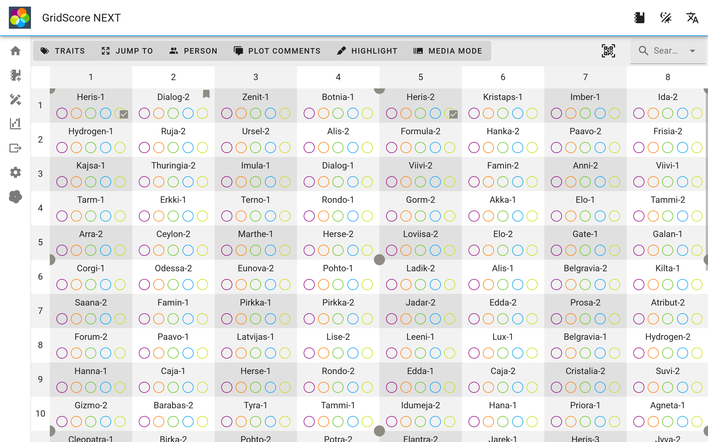
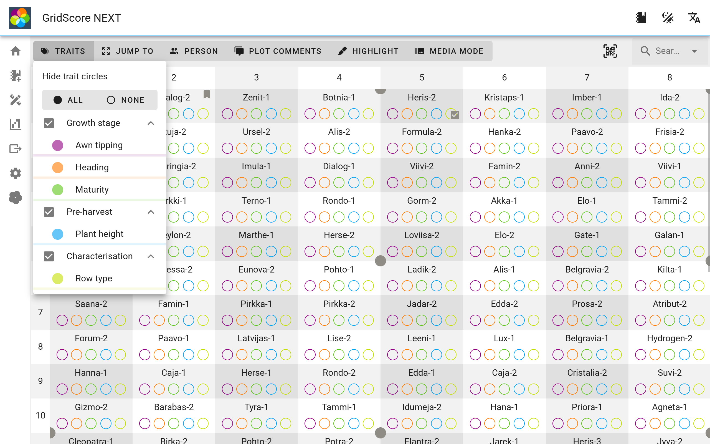
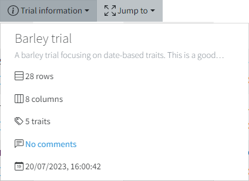
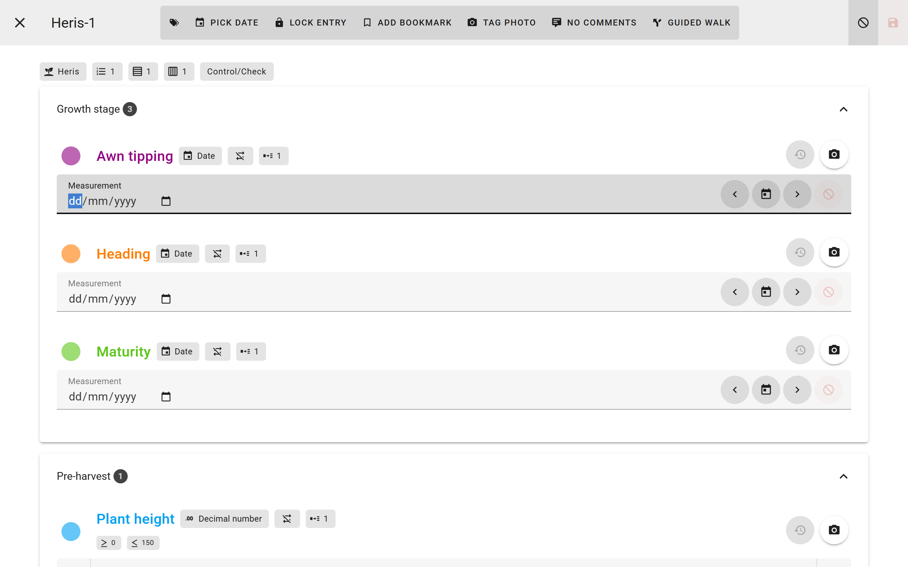
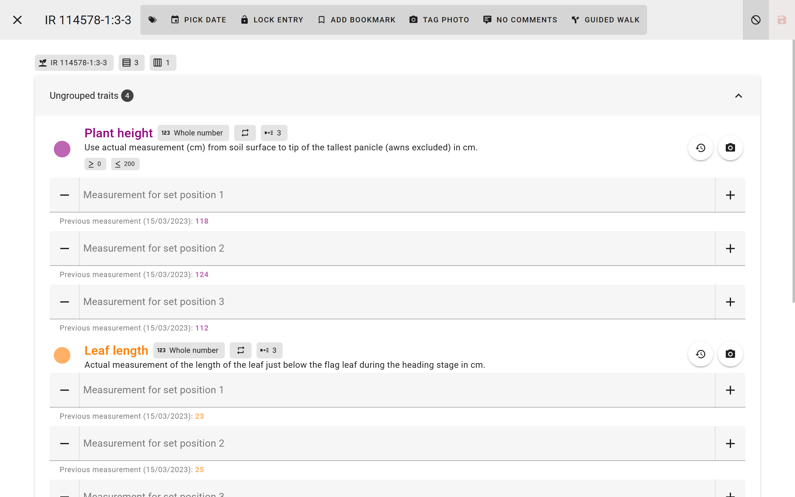
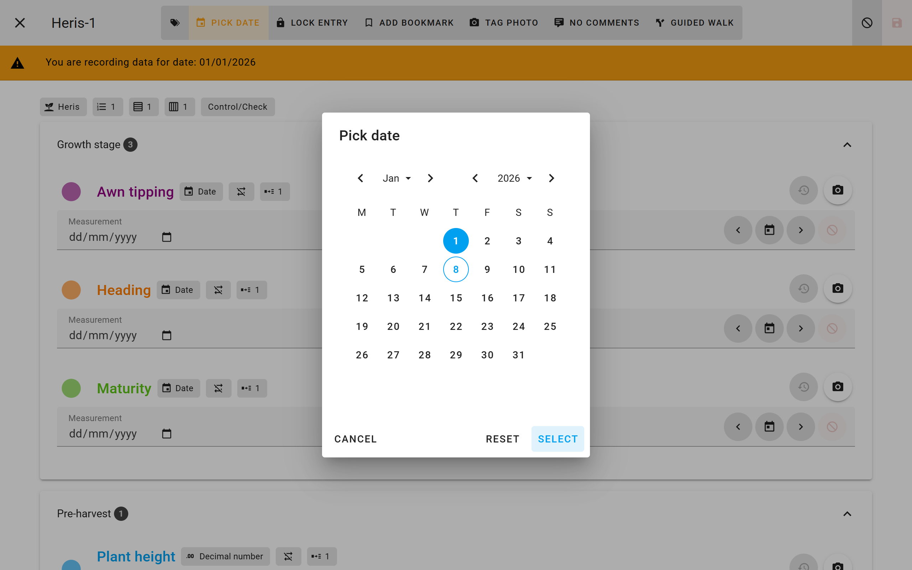
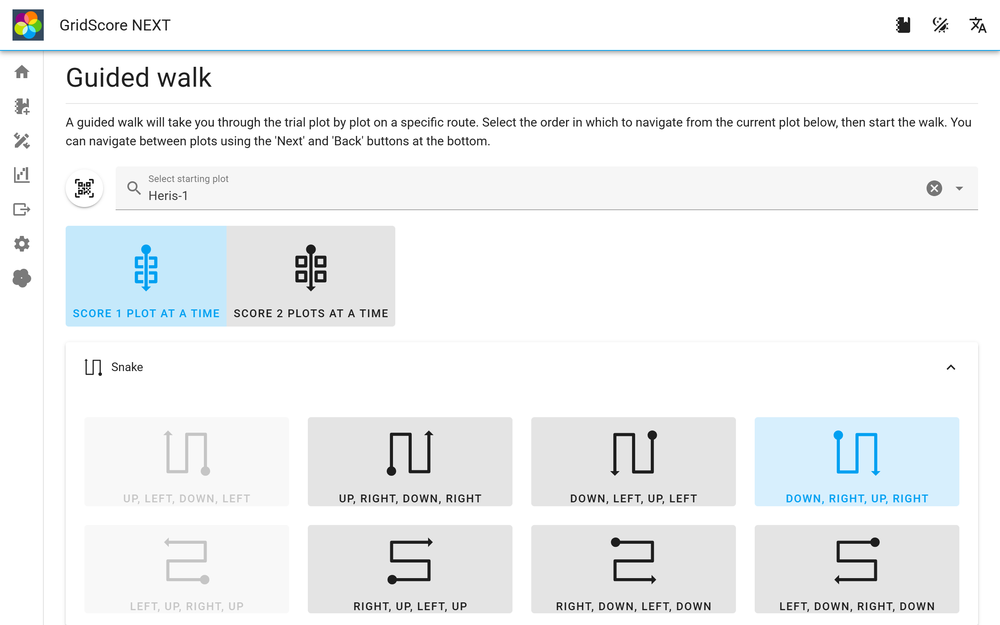
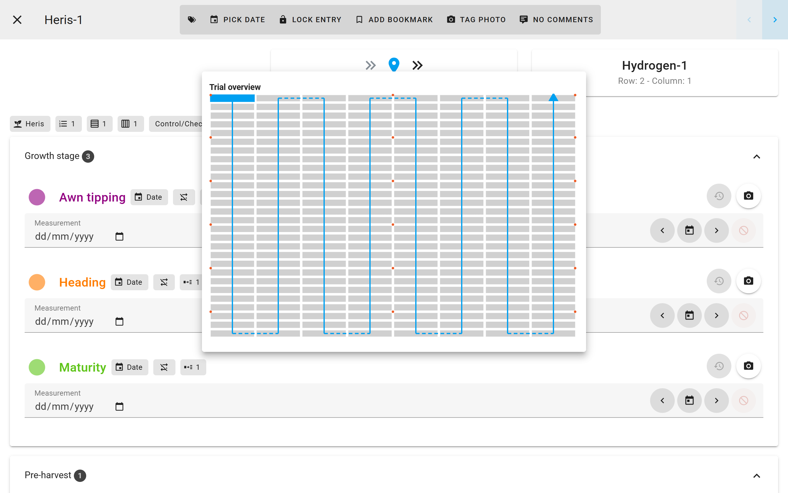

<a href="index.html" class="btn btn-dark">Home</a>

# Collecting data

The main goal of GridScore is to collect phenotypic data. The main data view of GridScore can be reached by selecting the `Data entry` menu item at the top of the screen after you have selected a trial from the front page.

Most of the screen is taken up by the visual representation of the field plan in tabular form. Rows and columns are displayed along the left and top edge while the cells in the table represent the plots.

The colored circles in each plot represent the traits that have been defined during the trial setup. Each on uses a different color (they repeat once unique colors run out). When you first start collecting data all of the circles will be empty. This just means that no data has been collected yet. As you record data, more and more of these circles will fill up which shows progress within each plot as well as overall.

The dropdown menus above the main display allow you to look and change `Trait visibility`, `Trial information` as well as to jump to corners of the trial.

 

The trait visibility selector can be used to toggle the visibility of individual traits or whole trait groups. This is useful if you want to focus on a specific trait or group and not worry about the others.

The trial information dropdown shows similar information about the current trial as you have seen on the home page. This is also where you can add comments to the whole trial.

---

To start collecting data you need to identify the plot you want to score. There are several ways of doing this:

- **Clicking on a plot**: This is probably the most straightforward way of selecting a plot. Just click on the one you want to record data for and the data input screen will open up.
- **Scanning a barcode**: If you are set up with barcodes, you can use them to identify the plot you want to score. The text encoded in the barcode will have to match the `Germplasm identifier` of the plot (refer to the <a href="trial-setup.html">trial setup</a>).
- **Using the guided walk**: GridScore can guide you through the trial using the guided walk mechanic. You won't have to select plots individually when using this, simply clicking on the `Next` button will take you to the next plot. Guided walks and how to use them are explained further down the page.

The data input screen is shown as soon as you select a plot to score. Here, you can enter data for all currently visible traits. If you have defined trait groups, they will be used as tabs to keep the traits of each group together.

The section for each trait contains various elements. The name and color are most prominent with the data type, whether multiple measurements are allowed and the set size next to it. On the right side there is a history button that lets you look at previously recorded data for this trait and plot as well as an photo button to take images for this trait.

Below that is where you actually enter the data for the measurement set. In the screenshot we only see traits with a set size of `1`, so only one input box is visible per trait. Depending on the data type of the trait, the options here will be different. Numeric data types only allow entering numbers, while date traits let you pick a date from the calendar or use the buttons to the right to step through the dates. Categorical traits will show you the available value options to pick from.

This example shows a set size of `3`. In this case you get three input boxes for the trait. We can also see that the trait value restrictions are shown below the trait heading (`>= 0` and `<= 200`) and the previously recorded values (multiple measurements have been enabled for this trait) are shown below the respective data inputs.

Sometimes you may be in a situation where someone has recorded some of the data by other means and you want to retrospectively add it to GridScore. Since GridScore will usually assume that the time point when you enter the data is also when it has been recorded, it will default to using the current timestamp for new data points. You can, however, tell GridScore that the data you're entering is from a different day. Use the `Pick date` button at the top of the screen to select the date and then proceed to entering the data. The selected date will remain active until you set the date back to today. A large yellow banner will make sure that you cannot miss the fact that a different date has been selected.

Guided walks are a way for GridScore to guide you through the trial along one of eight pre-defined routes. This way you don't have to worry about selecting the correct next plot in the trial.

To use this feature, select a starting plot from the main data view, then select the `Guided walk` button at the top. You will see the 8 different options of proceeding through the trial. Depending on the location of the starting plot, some options may be disabled as walking in that direction would directly finish the guided walk.

After you selected the direction and clicked `Start`, you will get back to the data input screen. Now, though, the bottom buttons have been replaced with a `Previous` and a `Next` button that will take you through the trial in the pre-defined order. Also note the preview of the previous, current and next plot above the trait inputs.

<a href="index.html" class="btn btn-dark">Home</a>