<a href="index.html" class="btn btn-dark">Home</a>

# Collecting data

The main goal of GridScore is to collect phenotypic data. GridScore offers a variety of ways in which you can identify plots to score and there are three dedicated data inputs screens for this purpose - all found under the `Data entry` menu item:

1. `Data grid`: This is the original data input screen of GridScore. It visually represents the field plan with rows and columns, each plot visualized as a rectangle in this layout.
2. `Guided walk`: A guided walk is what we call a collection sequence through the trial; meaning a pre-defined sequence of plots which is followed step by step.
3. `Search/scan`: When utilising barcodes or QR-codes to identify individual plots/pots, this input method might offer the best performance as it only requires you to scan the code to open the data input.

## Data grid

The main data view of GridScore can be reached by selecting the `Data entry` then `Data grid` menu item in the side menu after you have selected a trial from the front page.

Most of the screen is taken up by the visual representation of the field plan in tabular form. Rows and columns are displayed along the left and top edge while the cells in the table represent the plots.

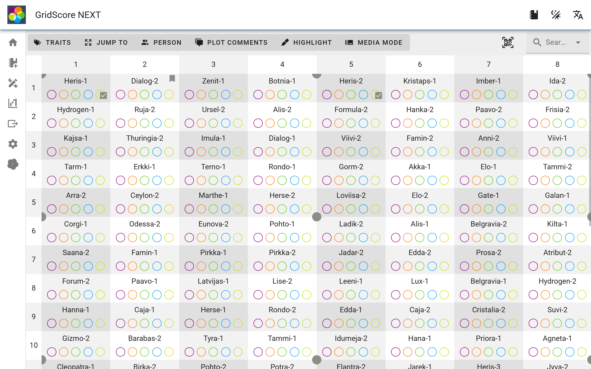

The colored circles in each plot represent the traits that have been defined during the trial setup. Each on uses a different color (they repeat once unique colors run out). When you first start collecting data all of the circles will be empty. This just means that no data has been collected yet. As you record data, more and more of these circles will fill up which shows progress within each plot as well as overall.

The actions above the data input allow you to toggle trait visibility, jump to the far corners of a trial, select the currently recording person, highlight specific plots and enable/disable media mode.

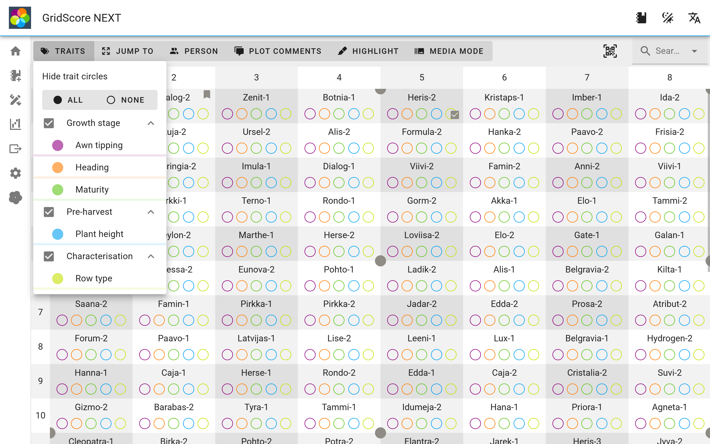

The trait visibility selector can be used to toggle the visibility of individual traits or whole trait groups. This is useful if you want to focus on a specific trait or group and not worry about the others. It also allows you to hide all trait circles (while keeping the traits active for data collection) which can be useful if you are encountering performance issues due to large number of traits.

If individuals have been defined for a trial, you can select the person who will be collecting data using the `Person` button.

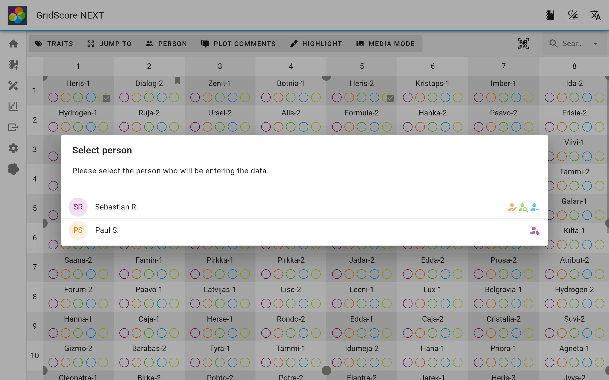

If comments have been added to a trial, a list of all plot comments can be displayed and filtered.

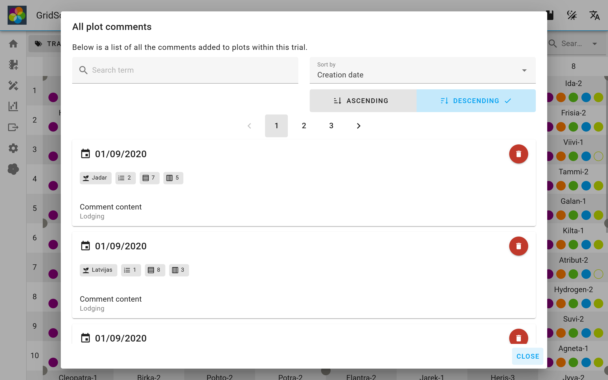

Highlighting will visually call attention to individual plots based on your selection. These include

- `No highlight`: Disable any previously selected highlight.
- `Highlight last scored plot`: To keep track of your location within the trial, GridScore can highlight the last plot you scored so you know which one to select next.
- `Highlight controls`: Highlight all plots that have been defined as controls/checks during setup.
- `Highlight bookmarks`: Highlight all plots that have been marked by users.
- `Highlight reps`: Highlight individually selected reps.
- `Highlight treatments`: Highlight individually selected treatments.
- `Highlight by name`: Highlight all plots whose main germplasm identifier contains the search term.

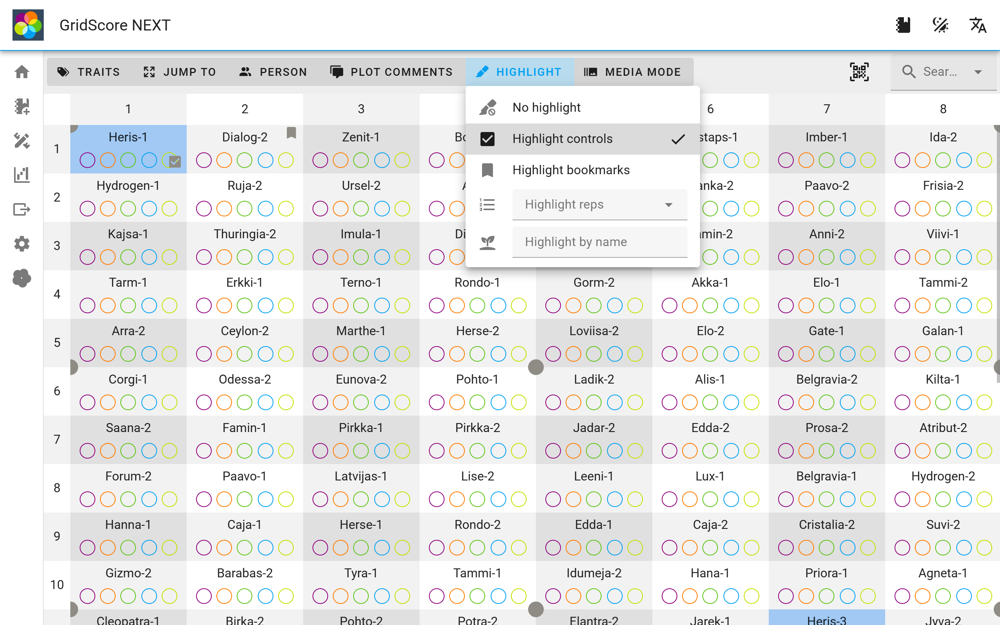
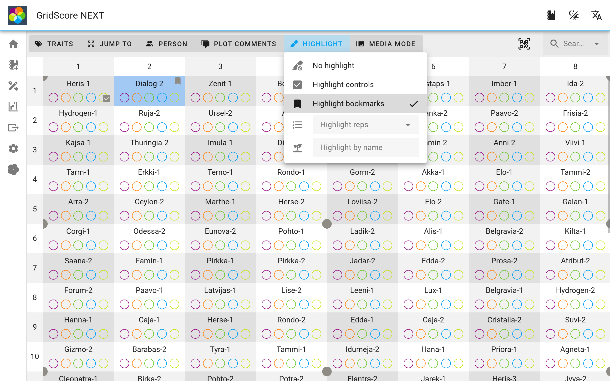
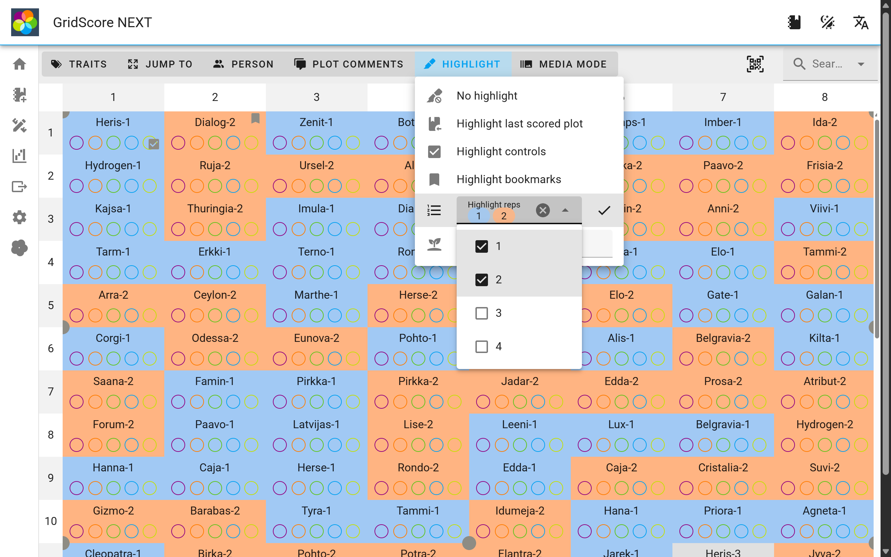
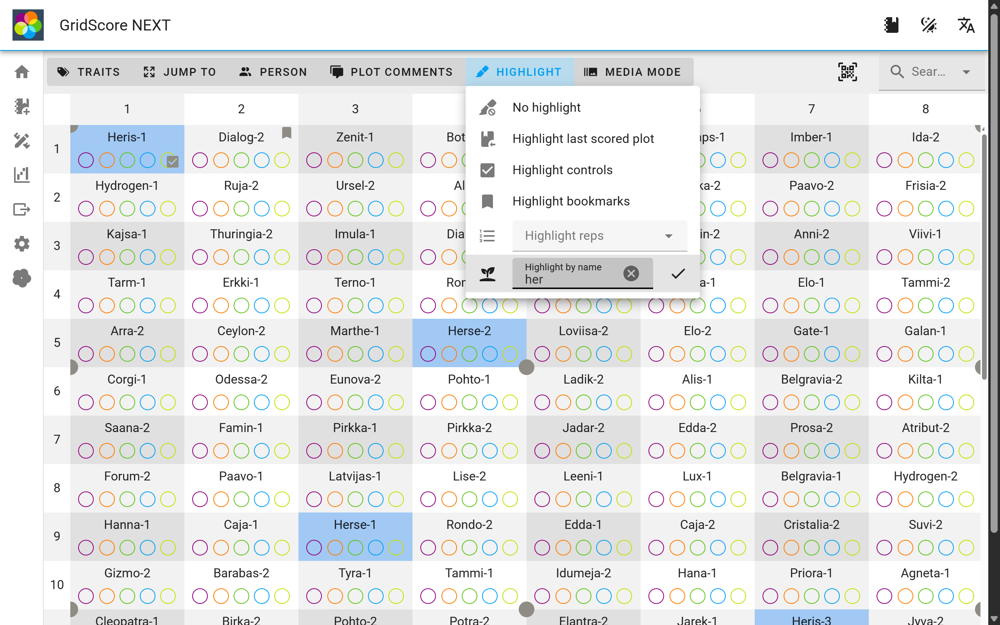

## Guided walk

Guided walks are a way for GridScore to guide you through the trial along one of eight pre-defined routes. This way you don't have to worry about selecting the correct next plot in the trial.

To use this feature, select a starting plot from the main data view, then select the `Guided walk` button at the top. Alternatively, select `Data entry` and then `Guided walk` in the side menu. The search bar at the top allows you to change your starting position by either scanning a code or typing in the germplasm identifier.

You'll now have to decide if you want to score a single plot at a time or two plots at a time while you're walking through the trial layout. Then you can select the type of traversal. A snake-like path will lead you along one row/column towards the end and then turn you back around so you can follow the next row/column. With the zig-zag option instead you'll be scoring all plots in the same direction as you traverse the trial row by row or column by column. This can be useful if you want to assess a plot with the same lighting conditions and sunlight angle.

Within each traversal type, there are 8 different options of proceeding through the trial. Depending on the location of the starting plot, some options may be disabled as walking in that direction would directly finish the guided walk.

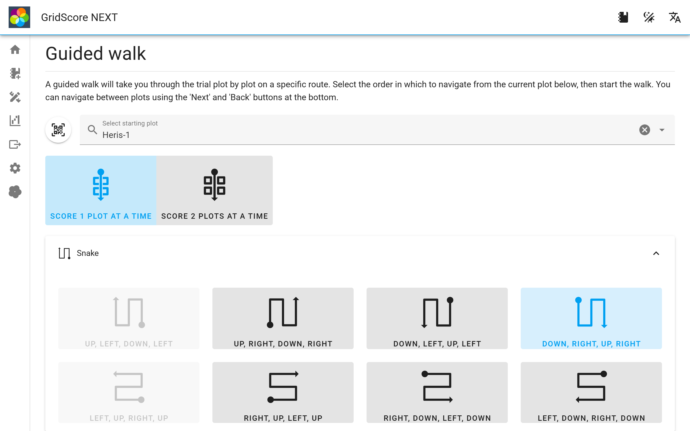
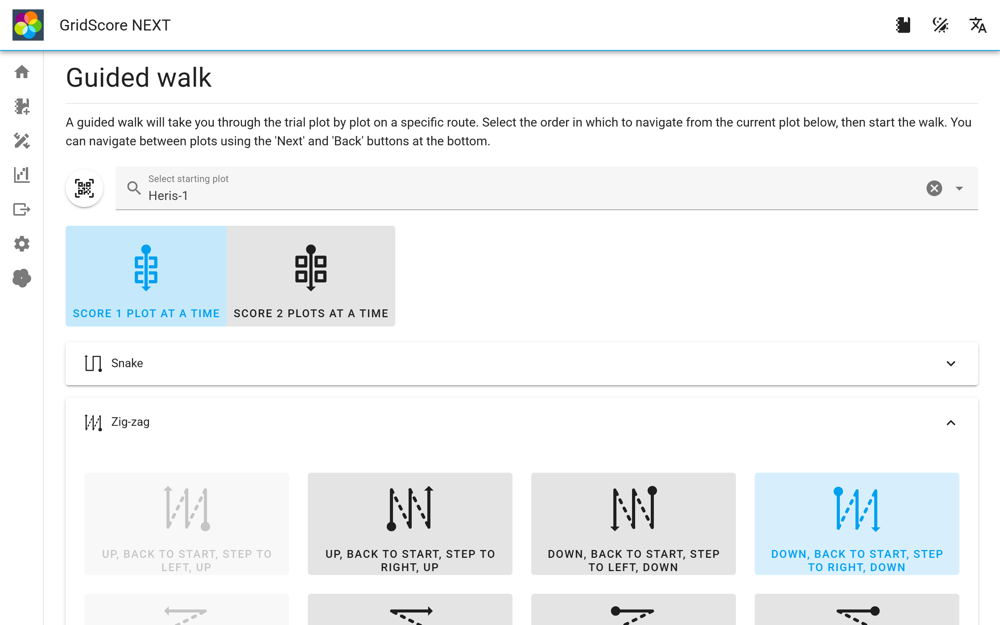
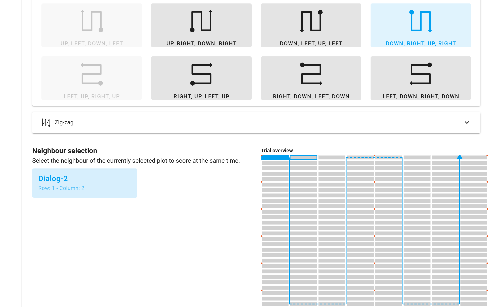
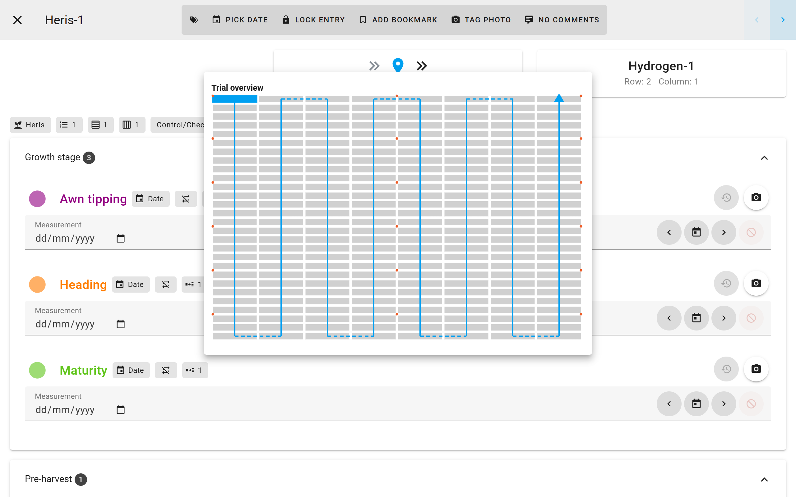

After you selected the direction and clicked `Start`, you will see the data input screen for your starting position. Now, though, the top buttons have been replaced with a `Previous` and a `Next` button (shortened to caret arrows on smaller screens) that will take you through the trial in the pre-defined order. Also note the preview of the previous, current and next plot above the trait inputs as well as a popup walk sequence preview.

## Search/scan

The last collection method is heavily barcode/QR-code focussed where you identify the plot you would like to score by scanning the respective code. Alternatively, you can use this to search for specific entries by entering the main identifier. Upon selecing an entry or scanning a code, the data input will open for this plot.

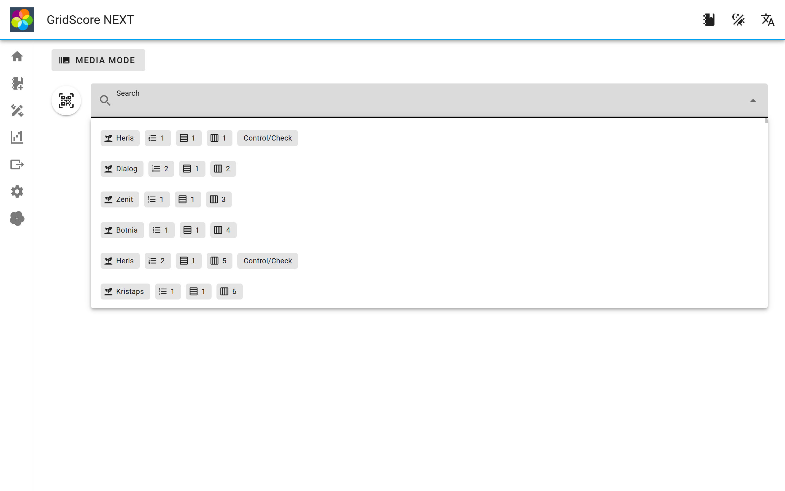

## Entering data

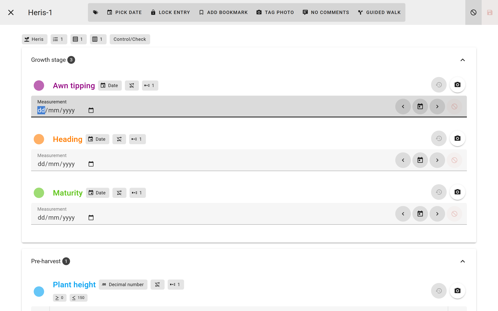

Whichever of the data collection approaches you end up using, the data input screen is shown as soon as you select a plot to score. Here, you can enter data for all currently visible traits. If you have defined trait groups, they will be used as expandable folders to keep the traits of each group together.

The section for each trait contains various elements. The name and color are most prominent with the data type, whether multiple measurements are allowed and the set size next to it. On the right side there is a history button that lets you look at previously recorded data for this trait and plot as well as an photo button to take images for this trait.

Below that is where you actually enter the data for the measurement set. In the screenshot we only see traits with a set size of `1`, so only one input box is visible per trait. Depending on the data type of the trait, the options here will be different. Numeric data types only allow entering numbers, while date traits let you pick a date from the calendar or use the buttons to the right to step through the dates. Categorical traits will show you the available value options to pick from.

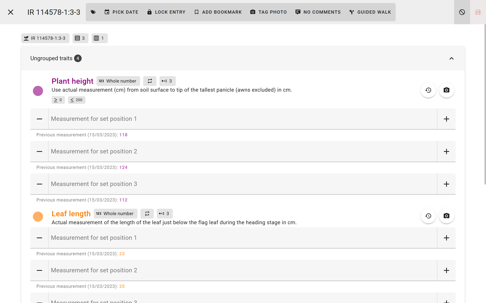

This example shows a set size of `3`. In this case you get three input boxes for the trait. We can also see that the trait value restrictions are shown below the trait heading (`>= 0` and `<= 200`) and the previously recorded values (multiple measurements have been enabled for this trait) are shown below the respective data inputs.

### Retrospective data entry

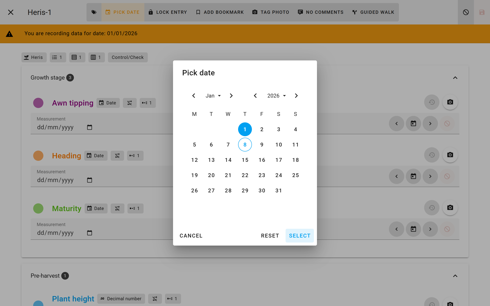

Sometimes you may be in a situation where someone has recorded some of the data by other means and you want to retrospectively add it to GridScore. Since GridScore will usually assume that the time point when you enter the data is also when it has been recorded, it will default to using the current timestamp for new data points. You can, however, tell GridScore that the data you're entering is from a different day. Use the `Pick date` button at the top of the screen to select the date and then proceed to entering the data. The selected date will remain active until you set the date back to today. A large yellow banner will make sure that you cannot miss the fact that a different date has been selected.

### Locking plots

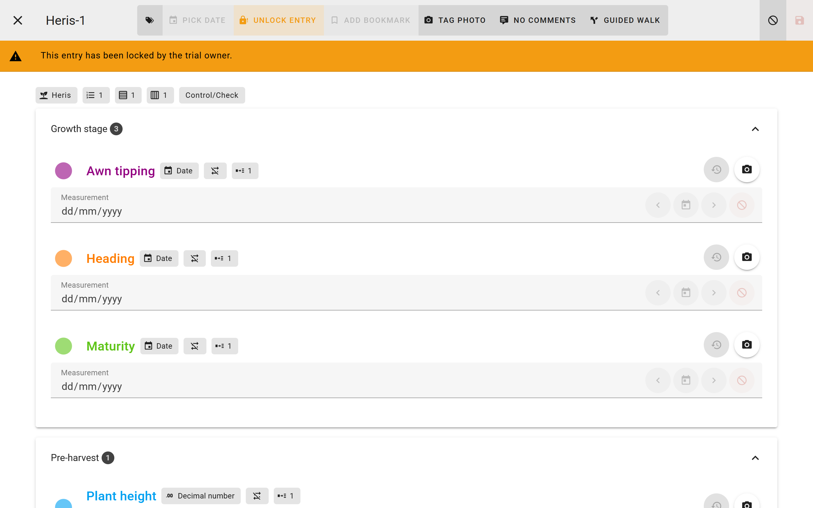

The owner of a trial can at any point decide to lock certain plots/pots or even the whole trial. Once they have done this and they synchronized their changes, this plot will be locked for everyone. No data entry can take place for locked plots. When selecting a locked plot, the data input will be completely disabled apart from the image tagging functionality. Only a trial owner can unlock plots.

### Bookmarking plots

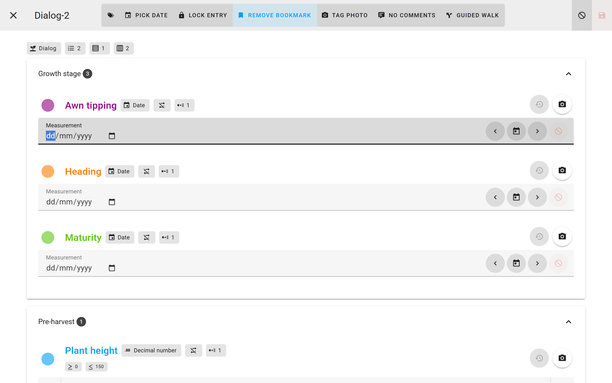

Bookmarks are a way of tagging a plot. This could be for the purpose of remembering to check certain plots the next time you go out for scoring or to remember where to continue your guided walk from if you couldn't finish the walk during your scoring session.

### Plot comments

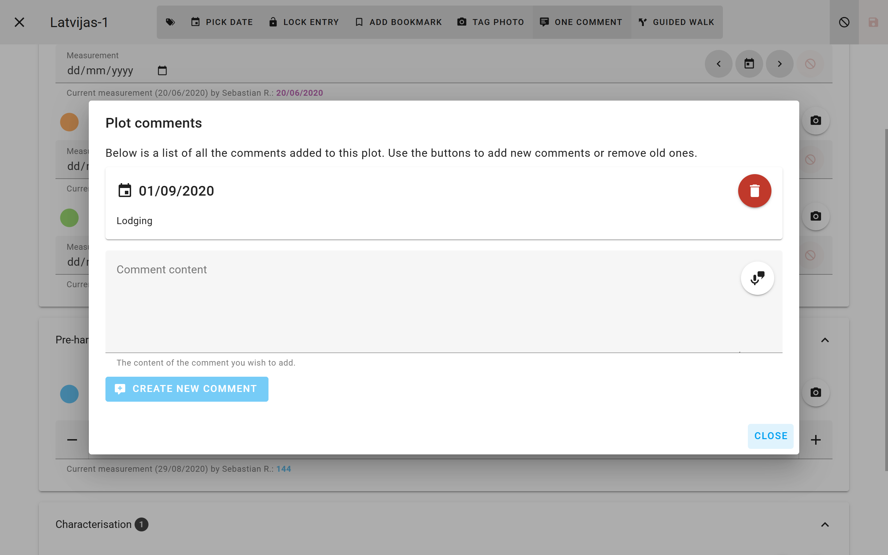

At any point, owners and editors can add comments to plots. These can contain any additional information that is deemed relevant. For example, a comment could highlight bird damage or diseases if these haven't been defined as traits already. Comments can also be deleted again at a later date.

<a href="index.html" class="btn btn-dark">Home</a>