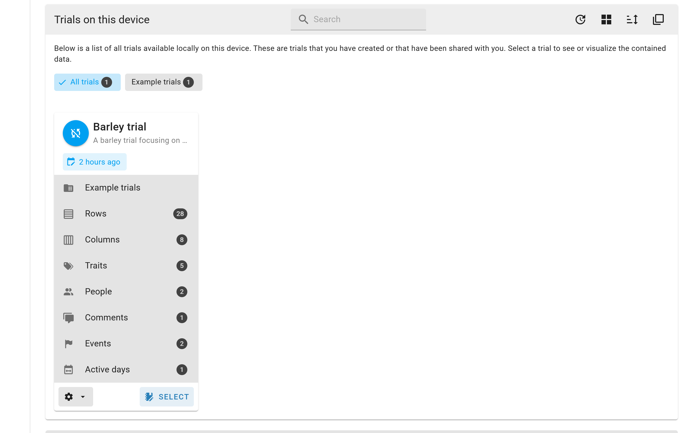
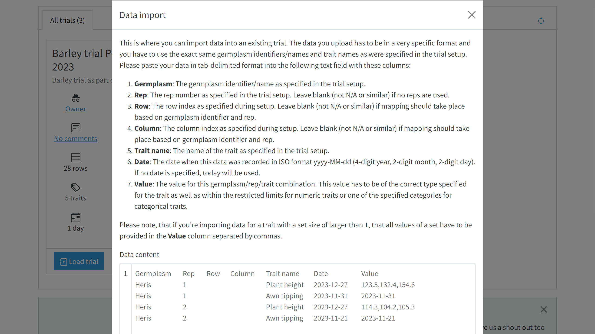

# Data import

In some cases, you may have pre-existing data you want to load into GridScore to pre-populate the trial. Or maybe someone has collected some of the data by other means and you want to join it into your GridScore trial. To import data into an existing trial, go to the `Home` page and identify your trial in the trial list. Use the cog menu and select the `Import data` item.

A modal window will open asking you to provide your data in a specific format. The format has to include the following columns with the exact column titles:

- **Germplasm**: The germplasm identifier/name as specified in the trial setup.
- **Rep**: The rep number as specified in the trial setup. Leave blank (not N/A or similar) if no reps are used.
- **Trait name**: The name of the trait as specified in the trial setup.
- **Date**: The date when this data was recorded in ISO format `yyyy-MM-dd` (4-digit year, 2-digit month, 2-digit day). If no date is specified, today will be used.
- **Value**: The value for this germplasm/rep/trait combination. This value has to be of the correct type specified for the trait as well as within the restricted limits for numeric traits or one of the specified categories for categorical traits.

Please note, that if you're importing data for a trait with a set size of larger than 1, that all values of the set have to be provided in the `Value` column separated by commas.

