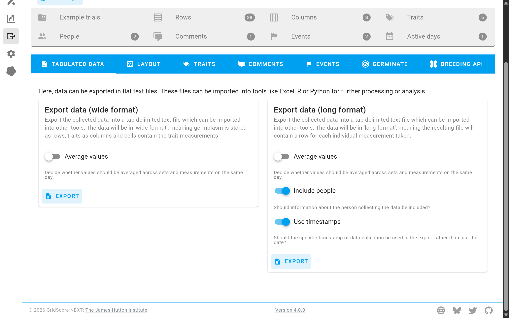
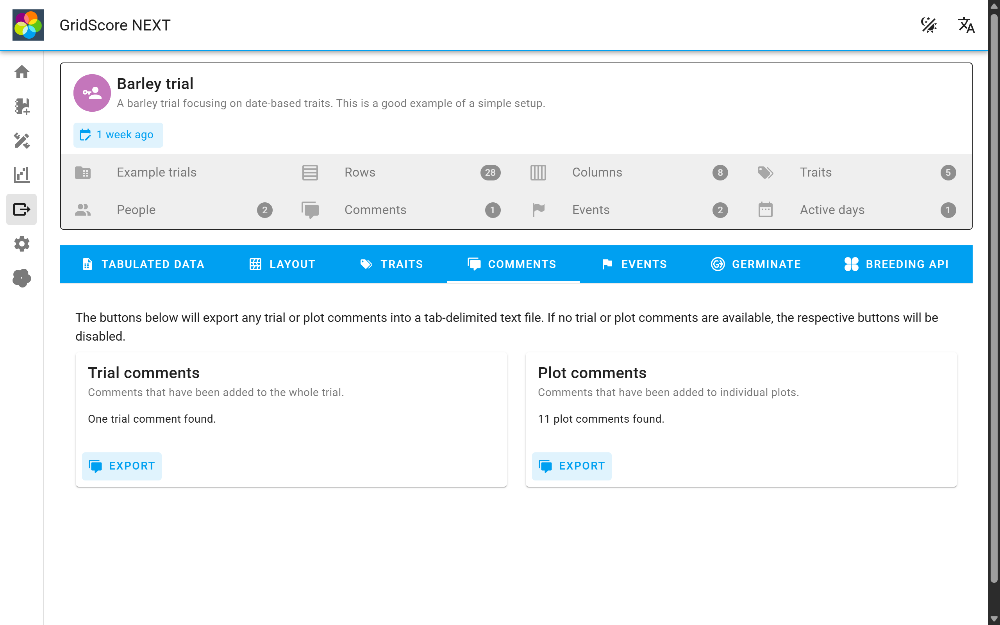
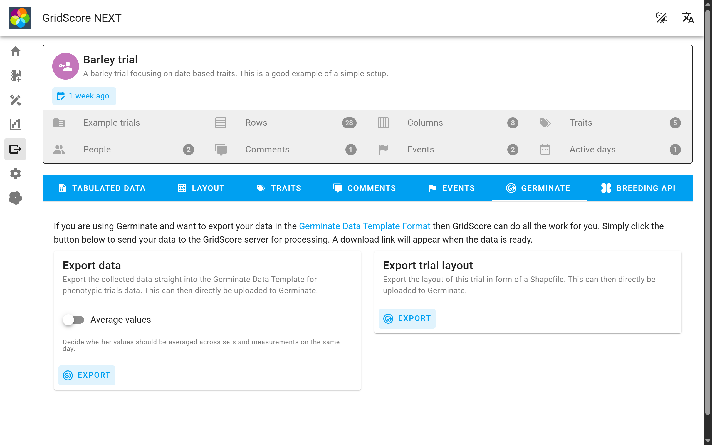
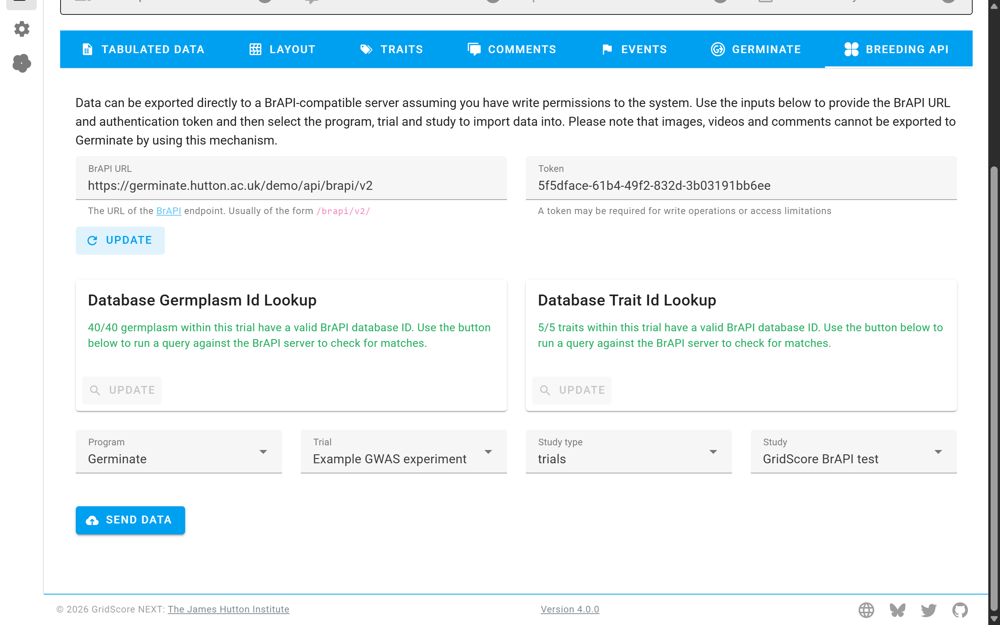

# Exporting data

Collecting your data with GridScore is an essential first step in your project. It will help you stay organized, improve the quality of your data, synchronize data collection across devices and offer advanced data visualizations on top of that.

At some point you'll want to export your data from GridScore and there are various ways in which you can do that.

## Tab-delimited trials data

This tab will allow you to export your data in a tab-delimited format where the genotypes are stored as rows and traits as columns along with other information about rep numbers, row index, column index, GPS location and collection date.

These files can easily be imported into tools like Excel, R and Python for data analysis or further visualization.

## Tab-delimited comments

Trial and plot comments can also be exported in tab-delimited form. They will be timestamped and in the case of plot comments, the germplasm identifier, rep number, row and column index are also exported.

## Germinate

[Germinate](https://ics.hutton.ac.uk/get-germinate) is a plant genetic resources database that has extensive support for trials data. GridScore can export a trial straight into the [Germinate Data Templates](https://github.com/germinateplatform/germinate-data-templates) making the data upload to Germinate as simple as a drag-and-drop exercise.

## BrAPI

The [Breeding API](https://brapi.org) (BrAPI) is an effort to enable interoperability among plant breeding databases. It basically gives you a blueprint of API endpoints to implement such that different tools can communicate with each other and move data around.

GridScore is BrAPI compatible and can export a trial using BrAPI to any BrAPI-compatible database as long as they implement the required endpoints.

In most cases you will need an access token for write operations to databases via BrAPI. Depending on the system there will be different ways of acquiring a token. You will also need the URL of the BrAPI endpoint. Once you have those, enter them into the BrAPI modal window that will have opened, or open it using the `BrAPI settings` button.

You will then have to use the lookup buttons to fetch the BrAPI database ids for the germplasm and traits. You can only continue if a match has been found for every single germplasm. Traits, if not found in the database, can be created after an initial lookup.

GridScore will then pull all available programs, trials, study types and studies so you can select the appropriate ones and finally send your data.