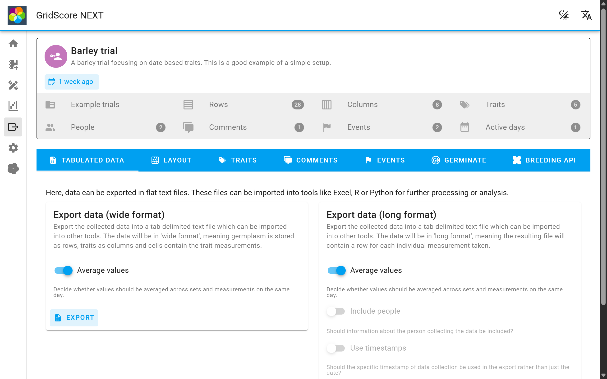
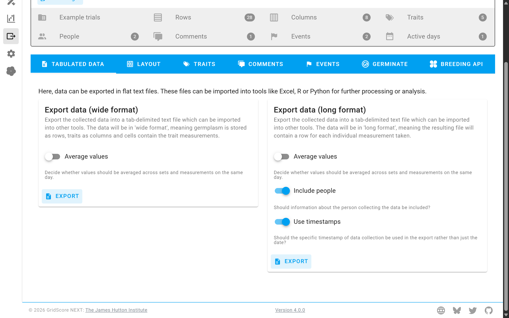
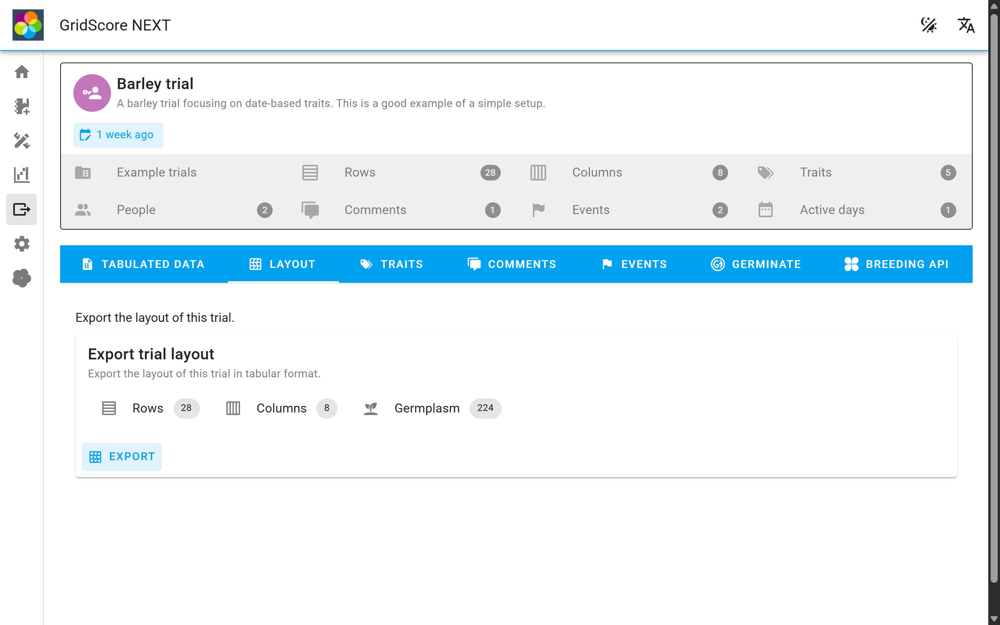
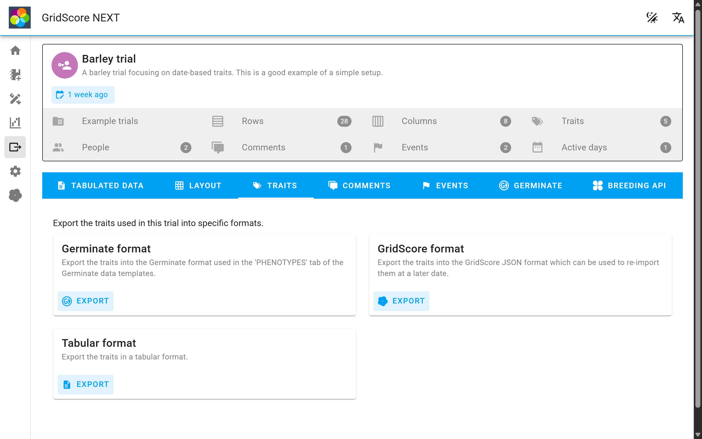
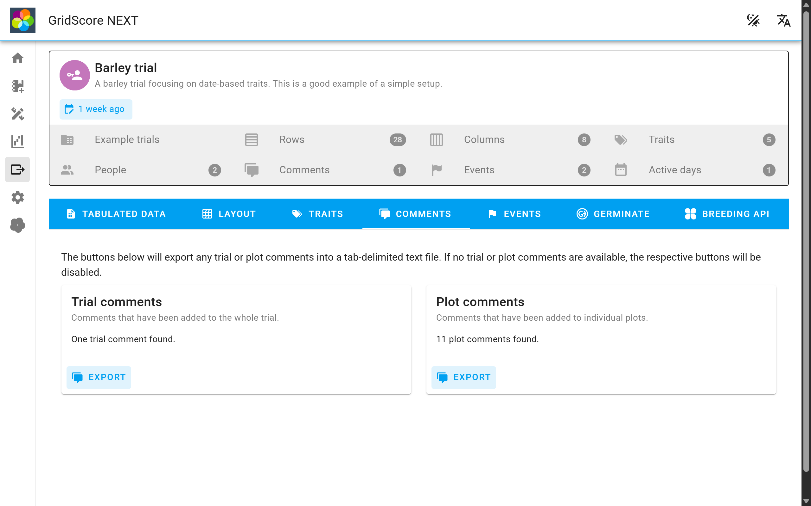
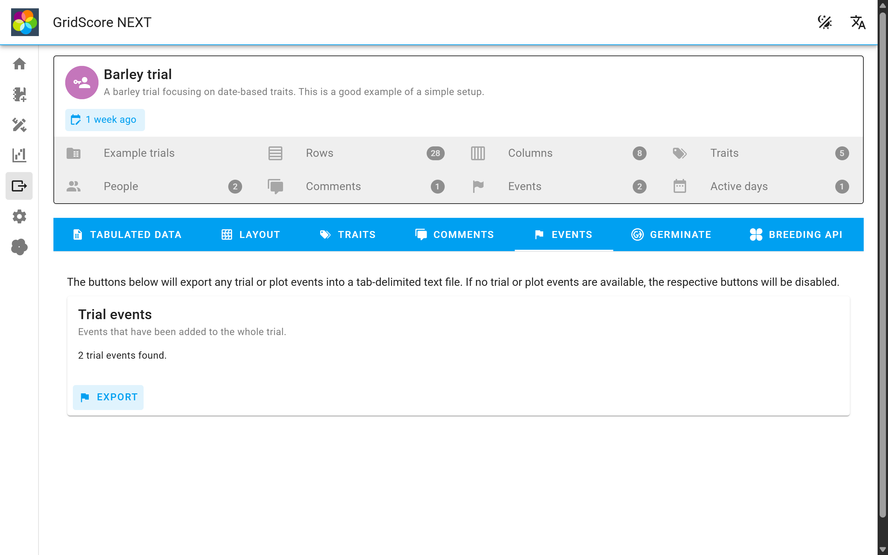
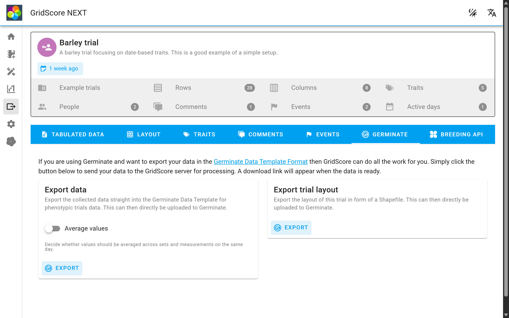
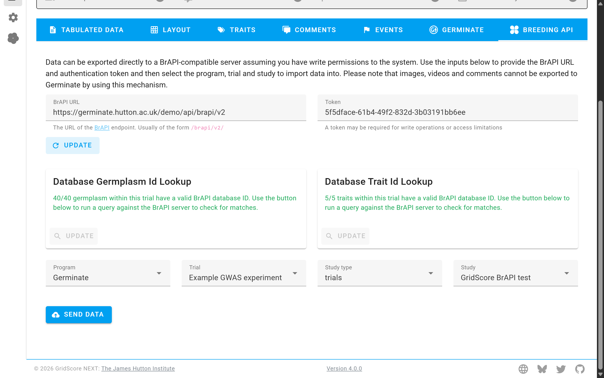

<a href="index.html" class="btn btn-dark">Home</a>

# Exporting data

Collecting your data with GridScore is an essential first step in your project. It will help you stay organized, improve the quality of your data, synchronize data collection across devices and offer advanced data visualizations on top of that.

At some point you'll want to export your data from GridScore and there are various ways in which you can do that. The export page gives you multiple tabs to export relevant types of information and data from a trial:

- `Tabulated data`: Export your data into tab-delimited data files to open in Excel or easily load into any programming language.
- `Layout`: Export the layout information of the trial.
- `Traits`: Export the trait definitions in a variety of formats.
- `Comments`: Export plot and trial comments.
- `Events`: Export any events that have been recorded.
- `Germinate`: Export your data into the [Germinate Data Templates](https://github.com/germinateplatform/germinate-data-templates) for easy upload to [Germinate](https://germinate.hutton.ac.uk).
- `Breeding API`: Export your data to any [BrAPI](https://brapi.org) compatible database.

## Tab-delimited trials data

The simplest export format will write your data into tab-delimited text files. There are two options here `Wide format` and `Long format`. The wide format will export your data as a matrix with plots/germplasm as rows and traits (and other metadata like GPS coordinates, date, etc) as columns. The long format will export each individual measurement as a row in the output, identified by the plot, trait, timestamp and set position. For the long format, you can choose to export the trial individual/person as well as switching the dates to timestamps.

## Layout

If you want to export the layout and plot metadata, you can do so from the `Layout` tab. This includes the germplasm identifier, rep, row, column, treatment, friendly name, barcode and pedigree.

## Trait definitions

The trait definitions that have been defined at the start of the trial (or added later on) can be exported in a variety of formats. These include `Germinate`, `GridScore` and `Tabular`.

The `GridScore` format is JSON formatted and is only really useful to re-import at a later date.

The `Germinate` format will restructure the trait definitions to arrange them in the same format as required by the `PHENOTYPES` tab in the Germinate Data Template for trials data.

The `Tabular` format is another way of exporting the trait definitions.

## Tab-delimited comments

Trial and plot comments can also be exported in tab-delimited form. They will be timestamped and in the case of plot comments, the germplasm identifier, rep number, row and column index are also exported.

## Events

In case any events have been recorded with GridScore, these can be exported in a tab-delimited form as well.

## Germinate

[Germinate](https://ics.hutton.ac.uk/get-germinate) is a plant genetic resources database that has extensive support for trials data. GridScore can export a trial straight into the [Germinate Data Templates](https://github.com/germinateplatform/germinate-data-templates) making the data upload to Germinate as simple as a drag-and-drop exercise.

## BrAPI

The [Breeding API](https://brapi.org) (BrAPI) is an effort to enable interoperability among plant breeding databases. It basically gives you a blueprint of API endpoints to implement such that different tools can communicate with each other and move data around.

GridScore is BrAPI compatible and can export a trial using BrAPI to any BrAPI-compatible database as long as they implement the required endpoints.

In most cases you will need an access token for write operations to databases via BrAPI. Depending on the system there will be different ways of acquiring a token. You will also need the URL of the BrAPI endpoint. Once you have those, enter them into the BrAPI section above the export area.

You will then have to use the lookup buttons to fetch the BrAPI database ids for the germplasm and traits. You can only continue if a match has been found for every single germplasm. Traits, if not found in the database, can be created after an initial lookup.

GridScore will then pull all available programs, trials, study types and studies so you can select the appropriate ones and finally send your data.

<a href="index.html" class="btn btn-dark">Home</a>