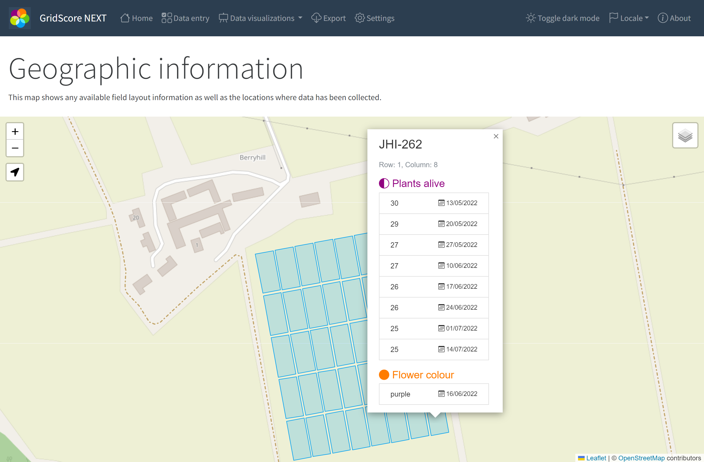

<a href="index.html" class="btn btn-dark">Home</a>

# Geographic data

GridScore stores geographic information during data collection and can use and collected GPS data in combination with any information provided during trial setup to plot the data and field trial on a map. In addition to that, GridScore can export the location and shape of each plot into a [Shapefile](https://doc.arcgis.com/en/arcgis-online/reference/shapefiles.htm) which can be imported straight into [Germinate](https://ics.hutton.ac.uk/get-germinate).

Check out the `Trial corners` section on the <a href="trial-setup.html">trial setup</a> page for more information about providing trial layout geography data.

The map shown below is available under the `Data visualization` section in GridScore and shows the position and shape of the individual plots if these are available. If these haven't been set up, GridScore will use any available GPS position from data collection to display a rough location of each plot. In any case, when clicking on the plot, a popup will show the data recorded for this plot by trait.

<a href="index.html" class="btn btn-dark">Home</a>