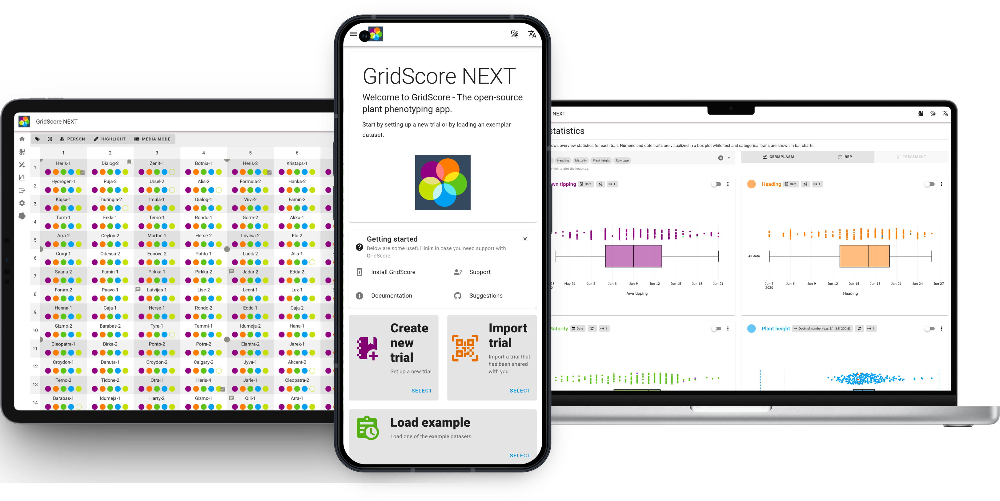

# GridScore NEXT

  

GridScore NEXT is a field trial phenotyping app for trait data. It lets you keep track of what's happening in the field on a plot-level basis. This could be anything from plant emergence, flowering date, plant height, flower colour, etc. You can define the layout of your field trial and the traits you want to score. GridScore then presents your data in a grid-like format representing your field layout. Data is recorded by clicking on a specific plot in a field and then entering your data.

GridScore offers a huge set of functionalities including:
- A wide range of trait data types including, integer, floating point, date, categorical and text.
- Data validation based on trait data type, ranges and valid values.
- Data visualizations including timeline charts, heatmaps and boxplots.
- Geo-referencing based on GPS position and field layout geometry.
- Guided walks that lead you through the trial in pre-defined orders.
- Barcode support for plot identification and data input.
- Data import and export in a variety of formats.
- [BrAPI](https://www.brapi.org) support for trait import and data export.
- Cross-platform support due to Progressive Web App technologies.
- Runs on pretty much any reasonably modern device.
- Offline support, so no internet connection is required when collecting and visualizing data.
- Distributed data collection achieved by trial sharing using QR codes and transactional data synchronization.

## Documentation

There are a few sub-pages that contain specific information about how GridScore works and how to use it. Use the links below to get to these pages.

- <a href="installation.html">Installation</a>
- <a href="overview.html">Interface overview</a>
- <a href="settings.html">Settings</a>
- <a href="trial-setup.html">Trial setup</a>
- <a href="collecting-data.html">Collecting data</a>
- <a href="tagging-images.html">Tagging images</a>
- <a href="trial-sharing.html">Data/Trial sharing</a>
- <a href="visualizing-data.html">Visualizing data</a>
- <a href="geographic-data.html">Geographic data</a>
- <a href="exporting-data.html">Exporting data</a>
- <a href="accessing-images.html">Accessing images</a>
- <a href="legacy-data.html">Legacy data migration</a>

## GridScore NEXT website

GridScore NEXT is available at [https://gridscore.hutton.ac.uk](https://gridscore.hutton.ac.uk)

## About

GridScore is developed and maintained by the [James Hutton Institute](https://www.hutton.ac.uk)

 

 
