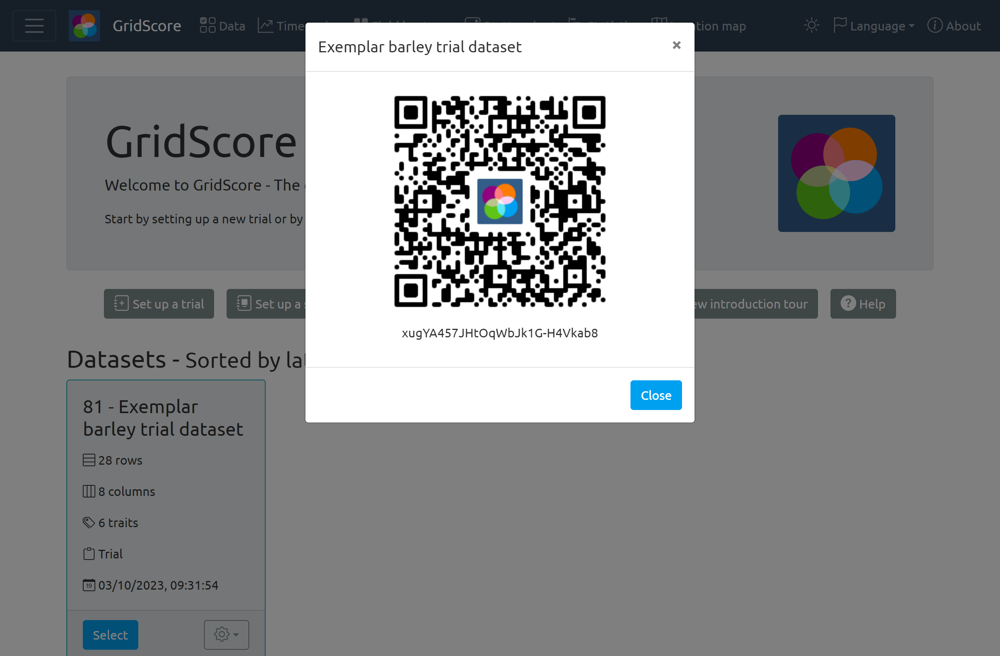
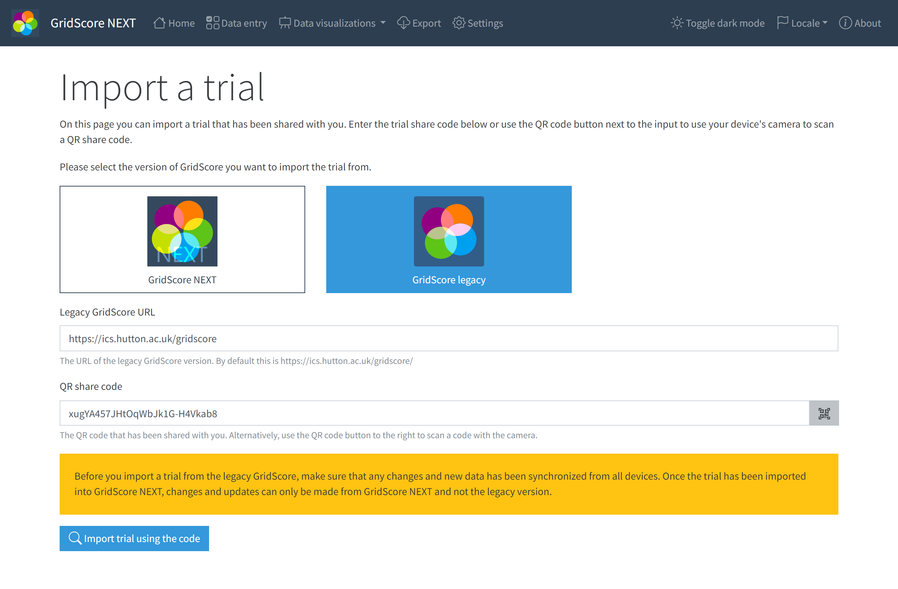
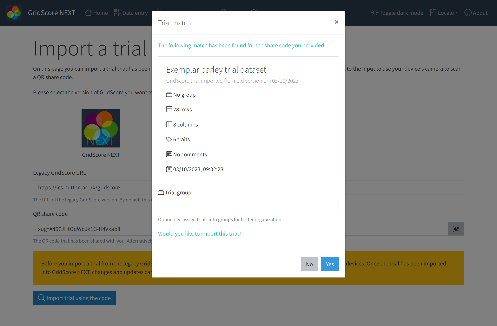
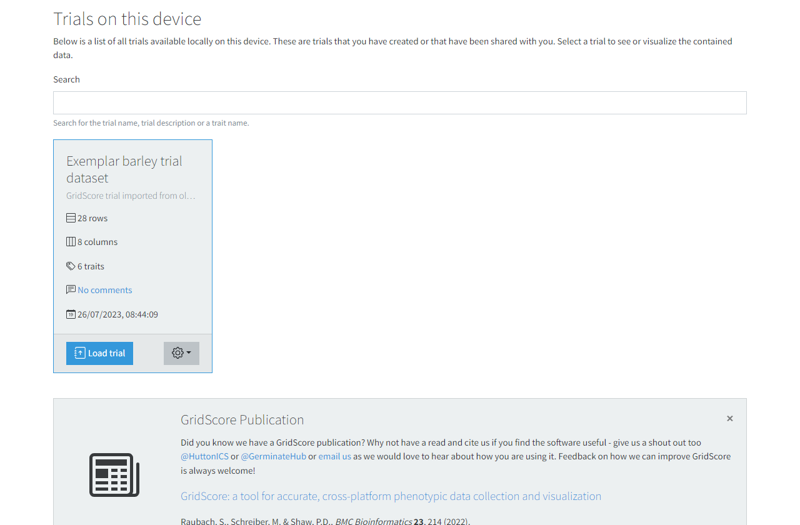

<a href="index.html" class="btn btn-dark">Home</a>

# Legacy data migration

If you are upgrading from GridScore to GridScore next, you may want to take your trial with you. We have made this process as simple as possible. All you will need is the sharing QR code that you generated for your legacy trial. If you don't have one yet, make sure to share your trial within the legacy GridScore application before you start.

**It's important that all changes that haven't been synchronized yet via the legacy GridScore are synchronized before you continue! Any unsynchronized changes will not be migrated to GridScore NEXT and cannot be migrated later on.**

The screenshot below show an example sharing code generated by the legacy GridScore.

Navigate to GridScore NEXT and select the `Import trial` option from the `Home` page. You will see two buttons at the top: `Current` and `Legacy`. Switch to `Legacy` to import a trial from the legacy version of GridScore.

The URL should stay the same. Paste your legacy GridScore sharing code into the text field or use the camera to scan the QR code.

When you press the `Import trial using the code` button, GridScore NEXT will check the legacy server for your data and show you a preview of your trial so you can make sure it's the correct one before continuing.

Once you confirm the legacy data import, you will be redirected to the `Home` page and your trial will now be part of your local trial list. Select it from the list to continue using your trial.

**Please note that you have to share this trial again with your collaborators. GridScore NEXT will generate a new sharing code as the old one is no longer valid. Please refer to the <a href="trial-sharing.html">trial sharing</a> section to learn more about this.**

<a href="index.html" class="btn btn-dark">Home</a>