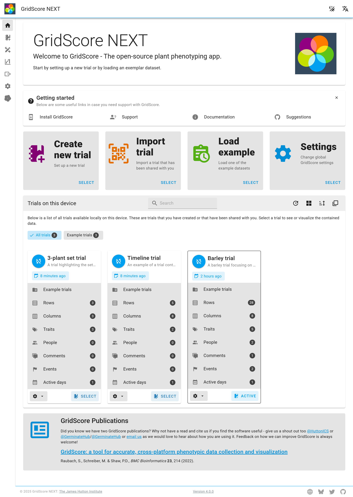
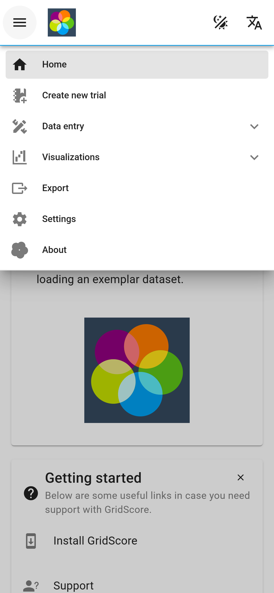
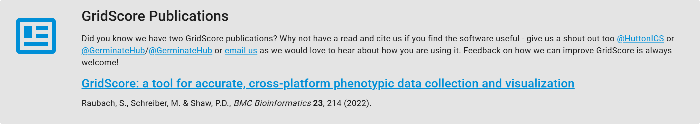

# Interface Overview

The home screen of GridScore is the first thing you see when you load the app and it's your central hub from which you can reach all functionalities GridScore has to offer. We'll now explain the individual areas of the home screen.

## Top navigation

The navigation bar along the top is used to switch between the different main areas of GridScore. These are `Home`, `Data entry`, `Data visualization`, `Export` and `Settings` as well as quick ways to toggle the dark mode, switch between languages and reach the about page.

The top navigation bar will always be visible on any of the pages. You can always use it to quickly get back to the home page.

On mobile devices, due to the limited horizontal space, the main navigation menu may be hidden and can be revealed by pressing the so-called Hamburger menu (button with three horizontal lines).

## Quick actions

There are four quick action buttons which are useful when first using GridScore, but will still be able to help you quickly reach the main functions of GridScore. They include:

1. **Creating a new trial**: This is where you can set up a new trial by providing the trial layout, germplasm information and trait definitions.
2. **Importing a trial**: You can import trials either by using a QR code that has been shared with you or by importing a legacy trial from the old version of GridScore.
3. **Loading an example trial**: GridScore comes with a set of example datasets that showcase the features available as part of GridScore. Load any of them and browse through the individual pages to see what's possible.
4. **Changing globals settings**: This is where you change global settings like trait colors, audio feedback, navigation mode and many more.

## Trials on this device

Once you have created or imported some trials, they will be listed on the front page in order of their last modification date listing the most current trials first. Each trial is represented with its name, description, dimensions, trait count and modification date. Use the `Load trial` button to collect data for it or visualize the contained data. The cog button in the bottom right of the trial card offers ways of sharing, duplicating or editing the selected trial.

- **Share**: The `Share` option allows you to share the given trial with others or simply another device using QR codes. The mechanism is explained on the dedicated <a href="trial-sharing.html">trial sharing</a> page.
- **Duplicate trial**: You can duplicate an existing trial. While doing so, you can make modifications to the layout and traits. You can also decide whether you want to copy any existing data across or start with a blank trial. There is a dedicated page explaining the <a href="trial-duplication.html">trial duplication</a> in more detail.
- **Edit trial**: The owners of the trial (see <a href="trial-sharing.html"> sharing page</a>) can make certain changes to a trial like changing name and description of the trial and the contained traits as well as adjust trial corner points and visual markers.
- **Add trait**: Trial owners and editors can add more traits at a later date if they have not been included in the initial trial setup. GridScore shows the exact same trait definition screen as during the trial setup, so you should be familiar with the process.
- **Import data**: Sometimes you want to import pre-existing data into GridScore and you can do this right here. There's a <a href="data-import.html">dedicated page</a> to explain this.
- **Delete**: At any time, you can delete any trial from your local device. Be aware that any unsynchronized changes made to a shared trial will be lost, so synchronize before you delete a trial. This trial will not be deleted from any other device it has been shared with and it will still exist on the GridScore server until it expires.

## GridScore publication

GridScore is available for free with no strings attached. You are free to use it for your research and commercial work. We have published a paper on GridScore and we would really appreciate it if you could reference our paper in your own publication if you've used GridScore for your data collection!

[GridScore: a tool for accurate, cross-platform phenotypic data collection and visualization](https://bmcbioinformatics.biomedcentral.com/articles/10.1186/s12859-022-04755-2)

Raubach, S., Schreiber, M., & Shaw, P.D., *BMC Bioinformatics* **23**, 214 (2022)

