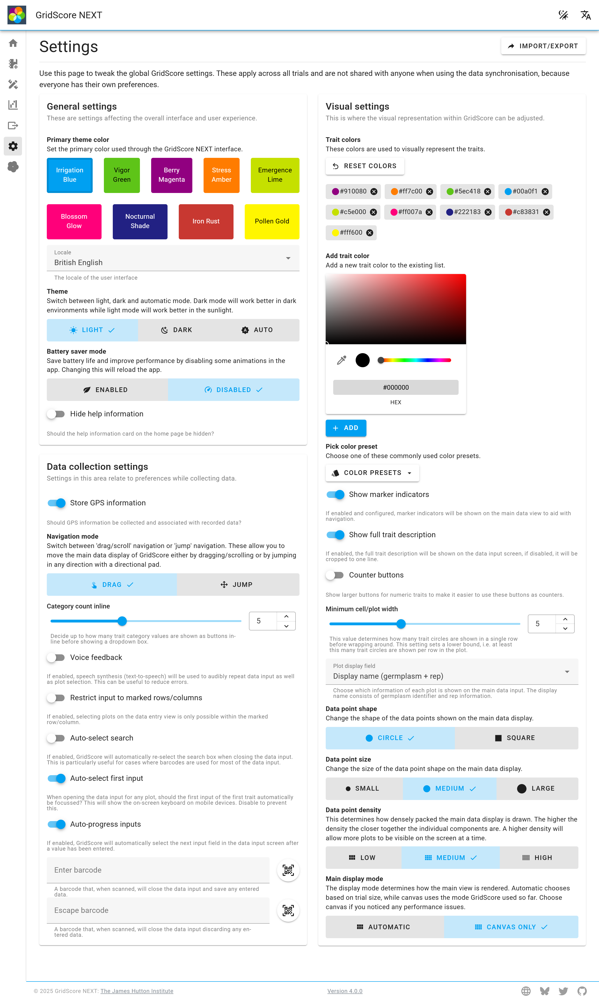
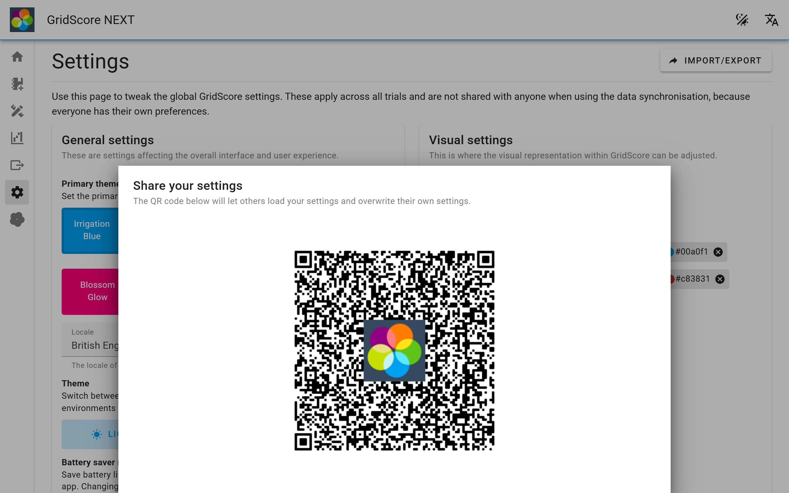

<a href="index.html" class="btn btn-dark">Home</a>

# Settings

The settings page allows you to make changes to properties that affect the overall functionality and looks of GridScore. The page is subdivided into three sections. We will now cover each section in turn and explain the contained settings.

## General settings
General settings include things that affect every page of GridScore. They include the language/locale and dark mode.

- **Locale/Language**: Use this dropdown box to select your language of choice from a pre-defined list of supported locales. If you're language/locale isn't available in the list, please get in touch and we can try and change this together.
- **Dark mode**: Depending on the lighting conditions you're working in, the user interface may be more usable in light or dark mode. Use the toggle to switch between them. Generally speaking, the light mode will work better in bright environments, whereas the dark mode is easier on the eyes in darker environments.

You can also access both of these settings from the main navigation menu at the top of the page from anywhere in GridScore.

## Data collection settings
This section contains any settings that affect the way data is collected.

- **Store GPS information**: This settings determines whether or not GridScore will utilize the GPS signal available on your device during data collection. There are multiple ways in which GPS data can be used by GridScore. By disabling this setting, GridScore will not store your device's location.
  - *Image tagging*: When you use the image tagging functionality of GridScore, we can use your GPS location to enrich the embedded information within the image's metadata.
  - *Defining trial corners*: The corners of a trial are used to determine the location and shape of each individual plot within the trial. You can either define the corner points during the trial setup or you can adjust them by using the <a href="trial-modification.html">trial modification</a> functionality.
  - *Georeferencing*: GridScore can use your GPS location to highlight where you are positioned within the trial both on the main data view as well as the map. This can be useful when navigating a trial.
  - *Data tagging*: While collecting phenotypic data, GridScore may use your GPS location to record where you have collected data for each plot. This information sits alongside the potentially available shape of each plot.
- **Navigation mode**: The navigation mode determines how you navigate the main data view. By default, this is set to `drag`, which means that you move around the trial by dragging the main data view like you would a map on a touch device. You can switch this to `jump` which will not react to drag events, but instead shows a button in the bottom right corner of the main data view that can be used to move the main data view in any direction using a directional pad.
- **Voice feedback**: When enabled, GridScore will use the speech synthesis (text-to-speech) functionality of your device to provide feedback on your data input. This is done in the form of audibly repeating the data you entered as well as the plot identifier and trait which has been selected.
- **Restrict data input**: Sometimes you want to make sure that you're only selecting plots to score from a certain row or column. For example, you may be walking along the first column in the trial and want to make sure you're not accidentally selecting a plot from the neighboring column. When this setting is enabled, GridScore will restrict the ability to select plots on the main data view to only those within the marked rows/columns. If no columns or rows are marked, any plot can be selected.

## Visual settings
Visual settings affect the way in which data is displayed on the user interface. You can adjust these settings here if you have a preference that differs from the default.

- **Trait colors**: GridScore uses colors to represent traits within the main data view as well as in any other location across the user interface. These colors have been chosen to be strike the balance between being colorblind-safe and visually appealing. Depending on your personal preference or visual needs, you can adjust these colors here by removing any colors you don't like and replacing them with any other colors.
- **Show marker indicators**: Marker indicators can be used to aid navigation within the trial. They will be displayed in a repeating pattern across both dimensions of the trial. Their position can be set during trial setup or adjusted later on. This setting determines whether they will be displayed on top of the main data display or hidden completely.
- **Minimum cell/plot width**: GridScore will try and fit as much data and as many plots as possible onto the main data view. This may result in the trial circles being wrapped multiple times to make more use of the horizontal space on screen. If you wish to ensure that at least a certain number of trait circles is displayed per row then adjust this setting. The more circles you choose the wider each cell/plot will become.

## Sharing settings

Any settings changed on this page will only affect your local device and will not affect anyone working on the same shared trial. It can sometimes be useful to make sure everyone uses the same settings across the trial, so we added a way to easily share these settings using a QR code. To use this feature, click on the share icon in the top right of the settings page. 

A new window will open presenting you with the QR code that reflects your current settings. You can then show this QR code to the other person who uses the `Load other settings` tab to scan your QR code. Once they have done so, their device will use the exact same settings as yours.

<a href="index.html" class="btn btn-dark">Home</a>