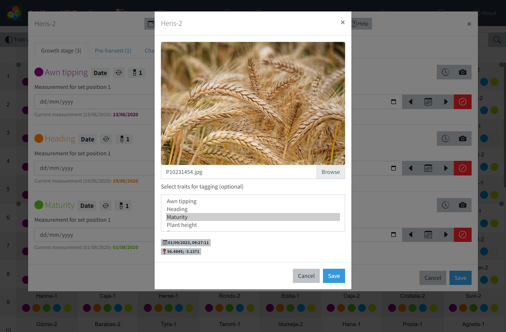
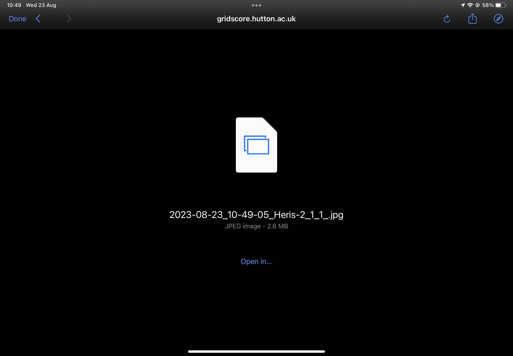

<a href="index.html" class="btn btn-dark">Home</a>

# Tagging images

GridScore can be used to take images during phenotyping which will automatically be tagged with the current GPS location, timestamp and the plot you are currently evaluating.

To take photos of a specific plot, select the plot in the main data view, then either select the image button in the top navigation bar or select the image button next to the trait for which you want to record an image.

A new window will open where you can take a photo. Once done, you will return to GridScore and a preview of the taken image will be shown. You can select associated traits from the list below the image. When you now save the image using the `Save` button, GridScore will download it to your device.

**Important**

On iOS devices, an additional step may be required to save the image. After selecting `Save`, iOS will show you a screen that looks similar to the screenshot below. Rather than directly pressing `Done` here, you have to select `Open in...` and then select `Save Image` or `Save to Files` to save the photo. If you don't do this, iOS will not save your image and it won't be available later.

<a href="index.html" class="btn btn-dark">Home</a>