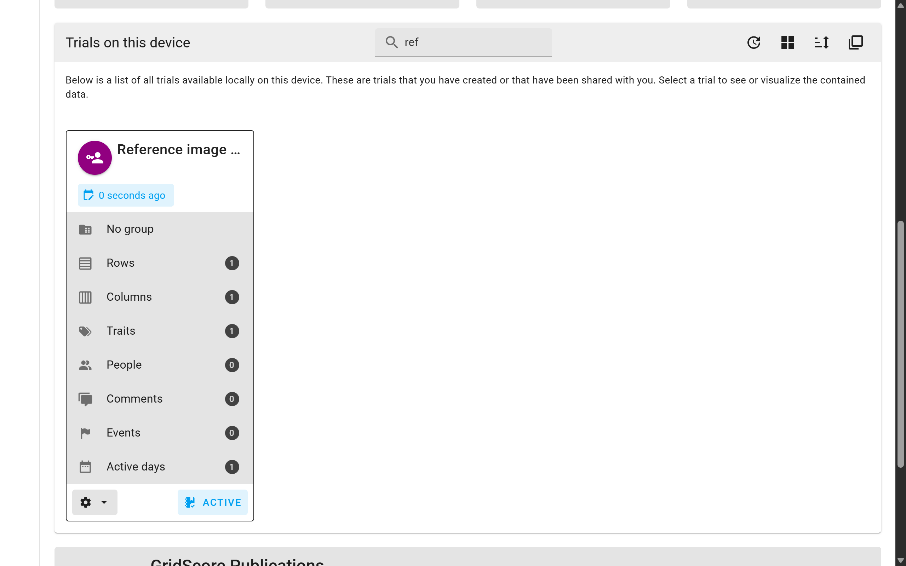
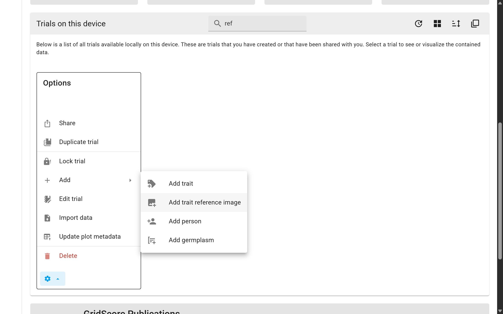
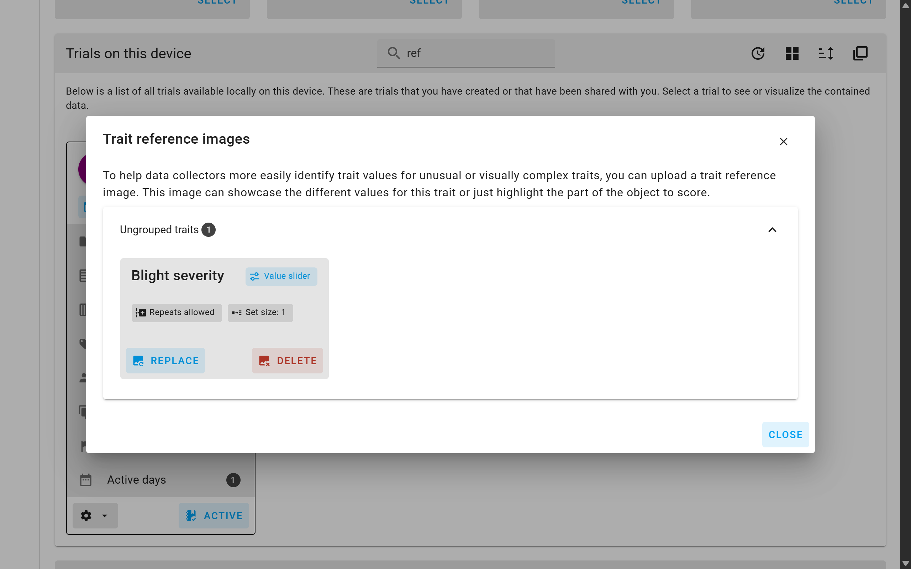
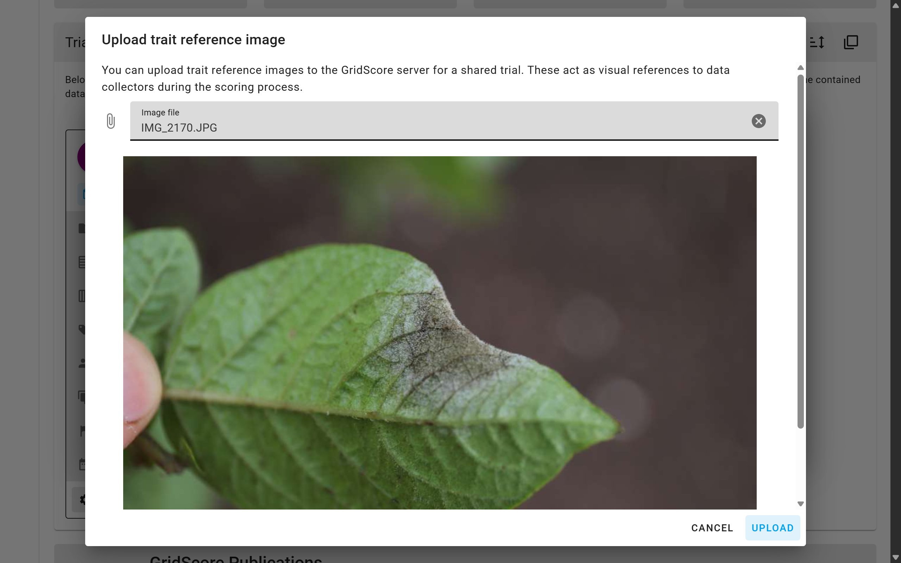
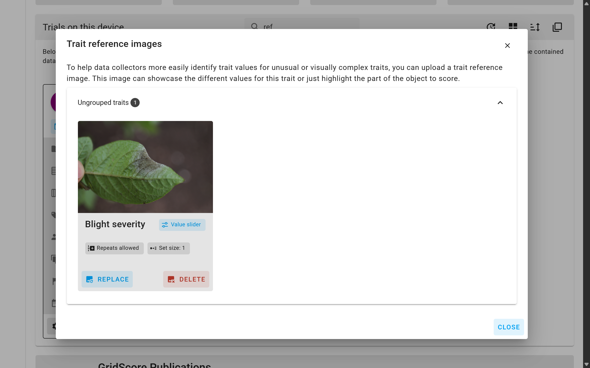
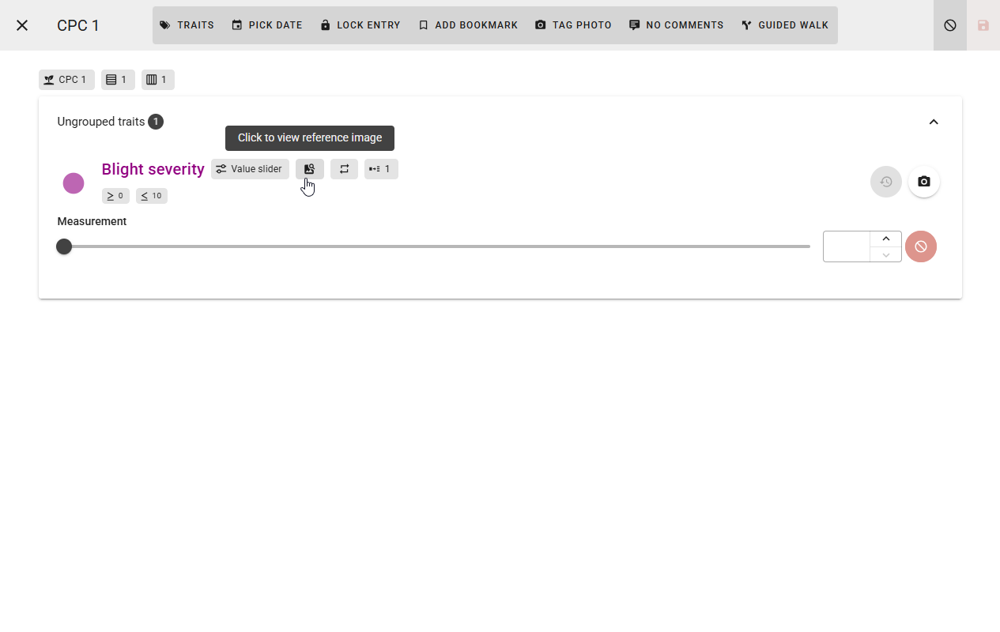

<a href="index.html" class="btn btn-dark">Home</a>

# Trait reference images

When scoring traits it can often be helpful to have a reference image to compare the phenotype of a plant to. Below are some examples:

The first example shows different values for a selection of categorical traits with an exemplar schematic of the corresponding phenotypic value.

<i>Image credit: "[Mendel's experiments: Figure 3](http://cnx.org/contents/24nI-KJ8@24.18:NjE8d7G4@7/Mendels-Experiments)," by Robert Bear et al., OpenStax,&nbsp; [CC BY 4.0](https://creativecommons.org/licenses/by/4.0/)</i>

Another example would be visual reference images for cereal growth stages.

<i>Image credit: [Structural and Spectral Analysis of Cereal Canopy Reflectance and Reflectance Anisotropy - Scientific Figure on ResearchGate](https://www.researchgate.net/figure/Modelled-phenology-stages-of-winter-barley-and-their-corresponding-BBCH-stages-The_fig1_328808159).</i>

Before adding reference images for traits to GridScore, the trial in question has to have been shared before. If it hasn't been shared yet, GridScore will disable the option to add reference images. The reason for this is simple: reference images are stored on the GridScore server and associated with the trial identifier to make them available to every trial participant.

To actually add a reference image to a trait, identify the correct trial from the home screen. Use the options menu (cog icon) show all available actions for this trial. Under `Add` you will find `Add trait reference image`. Selecting this option opens a new window which shows all traits grouped by their group. From here, you can upload one reference image per trait using the `Upload` button at the bottom of the trait card.

The window that now opens lets you pick an image file from your local device. The file will be restricted in size to a maximum resolution of 1080 pixels in either dimension. If you are happy with the selection, click on the `Upload` button. This will now send the image to the GridScore server and associate it with the trial and trait. The GridScore client application will also make sure that the image is cached for offline use.

Back on the trial reference image window, a small preview of the image should now be displayed within the trait card.

When collecting data for a trait with a reference image, a small image icon will be displayed in the trait heading and, when clicked on, will show the image.

<a href="index.html" class="btn btn-dark">Home</a>