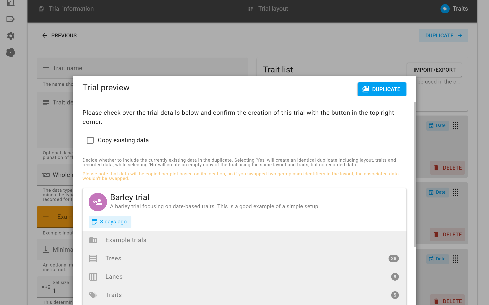

<a href="index.html" class="btn btn-dark">Home</a>

# Trial duplication

In certain situations it may be useful to duplicate an existing trial. To facilitate this, we have re-used the <a href="trial-setup.html">trial setup</a> screen where you can adjust certain properties of the trial. To duplicate a trial, go to the `Home` screen and click on the cog icon of the trial you want to duplicate. Select the `Duplicate trial` option here for the duplication screen to open.

As mentioned, this screen repurposes the setup screen to give you all the options of adjusting the duplicate as you have when you set up a new trial. The only difference on this page is the toggle button that lets you decide if you want to include the original data in the duplicate. You can disable this setting to create a duplicate that does not contain any of the recorded data - a blank sheet if you will.

Make adjustments as required and then press the `Create trial` button at the bottom to create your duplicate.

<a href="index.html" class="btn btn-dark">Home</a>