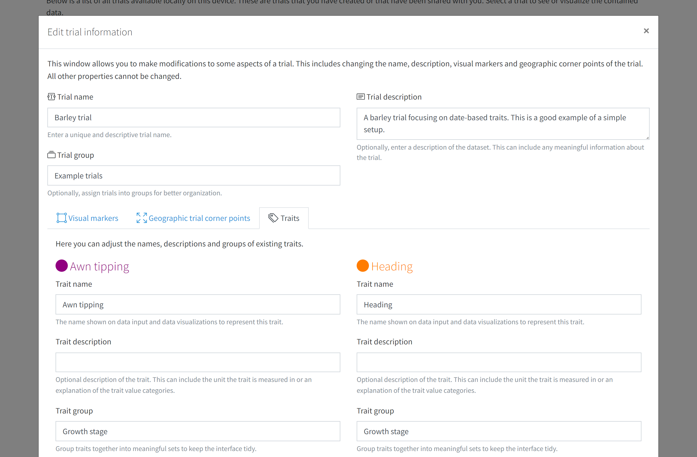

# Trial modification

If you are the owner of a trial or if a trial hasn't been shared yet, you can make certain changes to an existing trial. Go to the `Home` page and use the cog icon on the trial you want to modify. Select the `Edit trial` option to open the modification modal window.

Here you can make changes to trial properties. Check the <a href="trial-setup.html">trial setup</a> section for more detailed descriptions of these. Here is a list of what can be modified:

- **Trial name**: You can change the name of a trial if required. Please still make sure that it's a fairly short, unique and discriptive name.
- **Trial description**: You can also adjust the description of a trial.
- **Visual markers**: The visual markers can be adjusted.
- **Geographic trial corner points**: Corner points can be added or changed. When saved, this will adjust the position and shape of all plots within the trial accordingly.
- **Traits**: Certain properties of the existing traits can be modified. We do not allow to change the data type or the restrictions of a trait as these may conflict with already scored data.
  - **Trait name**: The name of a trait can be changed. Please note that the name may be used later when exporting the trial via BrAPI for the trait database id lookup.
  - **Trait description**: You can modify the description of the trait.
  - **Trait group**: You can add traits to a group or reassign groups as required.

Once you are happy with your changes, use the `Save` button at the bottom to persist your changes.