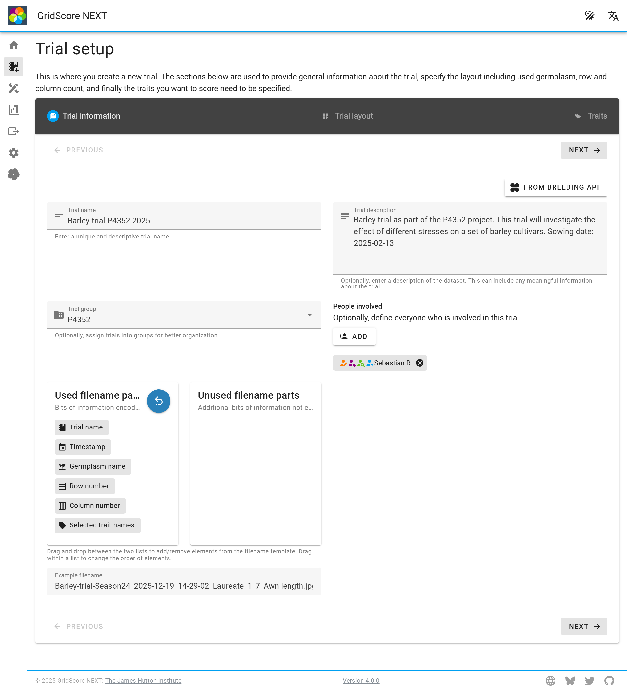
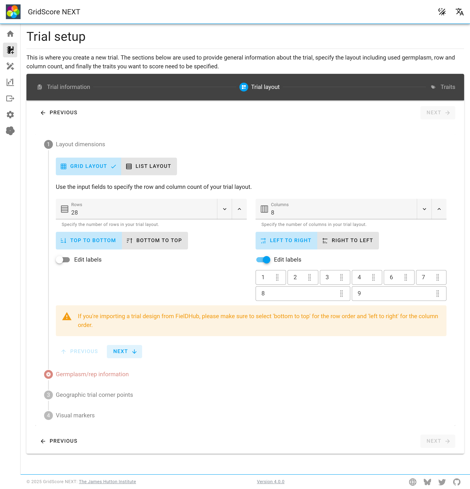
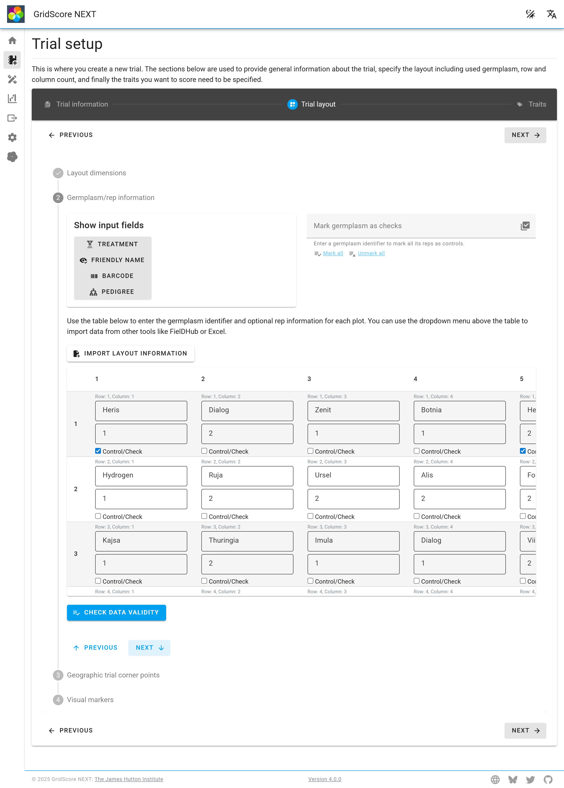
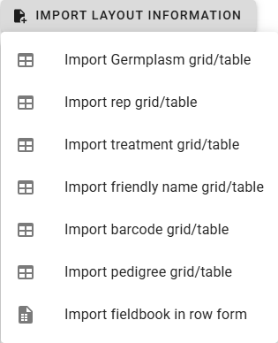
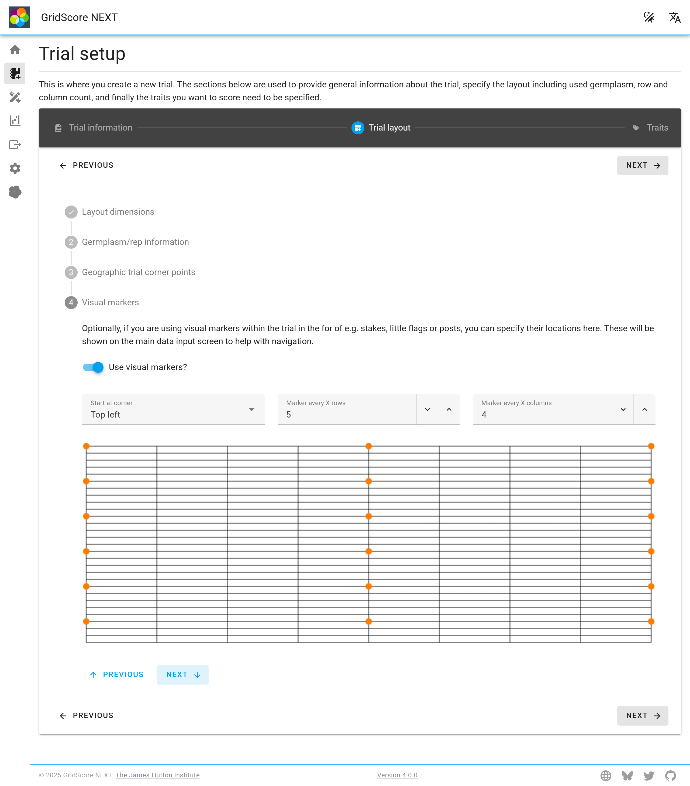
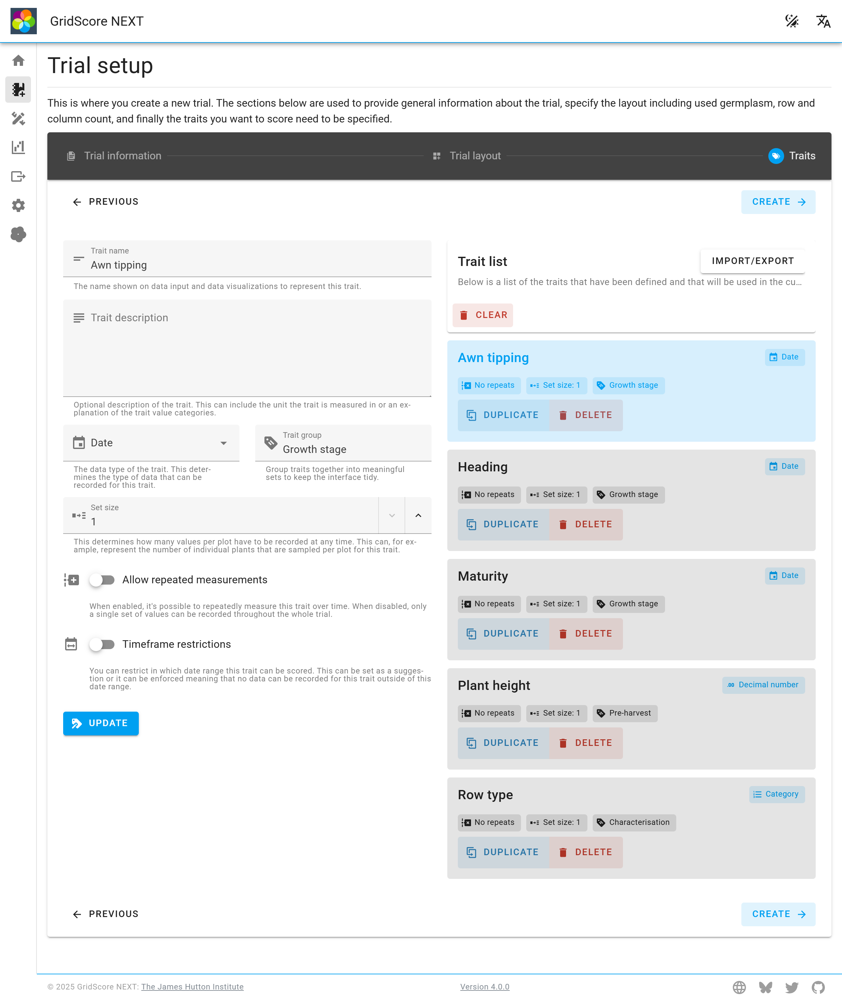

<a href="index.html" class="btn btn-dark">Home</a>

# Trial setup

Everything in GridScore evolves around trials. They are the main data unit. At a minimum, a trial consists of a `name`, the number of `rows` and `columns`, the `germplasm identifiers` for each plot and a number of `traits`. Additionally, there are more things that can be defined to provide more information about the trial itself or to aid in the data collection. On this page you will learn how to create a new trial from scratch, what information is required, how to provide it and what formats to use.

## Trial metadata


The screenshot above shows the trial setup screen. We have reduced the clutter of the setup screen by splitting it into separate sections and showing overviews on this main setup view. The two bits of information that can be specified here are the `name` and `description` of the trial.

- **Name**: This should ideally be a unique and distinctive, yet short name for your trial. It often makes sense to include the trial year and maybe a project code in the name.
- **Description**: This is where you can add more information about the trial. Anything that may be useful while using GridScore out in the field or that should be included once the trial is exported.

The two cards below the text fields summarize the two other areas that need to be provided for the trial. These include the `trial layout` (including dimensions, germplasm information, geographic information and visual markers) as well as the `traits` (including their data types, restrictions and groupings).

Click on the `Define` or `Change` button within each card to specify the respective information.

## Trial layout
The trial layout screen is where everything related to the trial dimensions, the contained germplasm as well as optional features like corner points and visual markers are defined. Use the tabs to switch between them.

### Dimensions


The trial dimensions need to be defined before anything else can be specified. They tell GridScore how many rows and columns you have in your trial.

If your trial is rectangular, then specify the total number of rows and columns in the trial. It's possible to leave individual cells/plots empty on the next screen, so you can achieve trials that have odd shapes.

If your trial does not follow a rectangular layout, you can still use GridScore, but you'll probably want to use barcodes to identify each individual plot/plant. In those cases, set the column number to 1 and use the row count to specify how many individuals you have in your trial. For the special case of only one row, GridScore basically becomes a list of items to score and it'll allow you to add new germplasm as you go along.

In addition to the dimensionality, you can choose in which order rows and columns are numbered. By default, GridScore will number them from the top-left corner, starting at row 1, column 1. You can switch both the row and column order separately to change this behavior to better suit your needs. If, for example, you are counting rows and columns from the bottom-left corner, reverse the row order to go from bottom to top, but keep the column order the same. This used to be a global setting in the old GridScore, but we realized that everyone working on the same trial will be using the same ordering while they may use different orderings for individual trials.

> NOTE: If you're importing a trial design from FielDHub, please make sure to select 'bottom to top' for the row order.

### Germplasm grid


Once the dimensions have been specified, GridScore needs to know which germplasm will be scored in each plot. To do this, select the `Germplasm/rep information` tab. You will see a table with the same dimensions as specified in the `Layout dimensions`. For each plot, you need to specify the following:

- **Germplasm identifier**: This is the identifier used for the germplasm in this plot. It can be an internal code, the variety name or something else.
- **Rep number**: Optionally, you can use rep numbers as well. These are specified here.

Please note that the combination of `Germplasm identifier` and `Rep number` needs to be unique for each cell/plot. This means you cannot use, for example, `Heris` and `2` as the germplasm identifier and rep number more than once.

If you are using controls in your trial, these will have to be uniquely identified by using the rep number. So if you have 8 controls and you're not using unique codes, give them the same `Germplasm identifier` but different `Rep number`s.

Rather than specifying the values for each plot manually, you can import data in different formats.



#### Import Germplasm grid/table

If you have your germplasm identifiers in the same format/shape as the field layout (same number of columns and rows), you can use the `Import Germplasm grid/table` import option. Paste your information in tab-delimited form into the text box and import your data. The table fill automatically be filled.

#### Import rep grid/table
The same is true for the rep number information. Use the `Import rep grid/table` dropdown option.

#### Import fieldbook in row format
In addition to these tabular formats, you can provide the information in a row-based format where each plot/cell is specified as a separate row. Tools like [FielDHub](https://github.com/DidierMurilloF/FielDHub) can be used to generate trial layouts and one of their export formats can be imported straight into GridScore. More generally though, if you have your information in a tab-delimited form where you have information on the following fields, you can import your data this way:

- **Germplasm identifier**: The identifier used for the germplasm in this plot/cell.
- **Row index**: The row index of the plot. This has to be between 1 and the total number of rows.
- **Column index**: The column index of the plot. This has to be between 1 and the total number of columns.
- **Rep number**: Information about the rep number for each cell. This is optional as long as the germplasm identifiers are unique.

An exemplar file would look like this:

```csv
Germplasm Rep Row Column
Heris     2   1   1
Dialog    2   1   2
...
```

Please note that the file has to be tab-delimited and not space-delimited as used here for clearer display.

### Trial corners


If you want to make use of the georeferencing capabilities of GridScore, you will have to specify the GPS coordinates of the corner points of the trial. This can either be done by selecting them on a map or by walking to the corner points of the trial and using the GPS button for each corner.

Note that this information can be specified at a later date by the trial owner, because you may not be able to provide this information when the trial is initially generated.

### Visual markers


Visual trial markers are dots that are added to the main data view to help with the navigation within a trial. Often, when a trial is set up in the field, stakes or other forms of posts will be used at regular intervals to mark every X rows and columns. GridScore can replicate this behavior. You will need to specify the interval both in the direction of the rows and columns and which corner to start from. A visual representation of the markers will be shown so you can verify your setup before continuing.

Once you are happy with your selection, use the `Save` button in the top right corner.

## Traits


The trait definition section can look a bit overwhelming the first time you use it, but the minimal set of information that is required for each trait is the `Trait name` and the `Data type`. All other information is optional and is only used to enable data validation, grouping of traits or other features that we will explain in the following sections.

- **Trait name**: The name of the trait. This should be a fairly short but descriptive name. It will be used prominently throughout the interface and within charts.
- **Trait description**: An optional description of the trait. This can include information about the mechanism in which the trait needs to be measured, the unit or an explanation of the individual trait category values.
- **Data type**: This defines what type the data will be in that's collected for this trait. The current options include:
  - `Whole number` (e.g. 3, 2004, -1)
  - `Decimal number` (e.g. 2.1, 3.5, 200.5)
  - `Value in range` (shows a range slider for values between minimum and maximum)
  - `Category` (requires specification of valid values)
  - `Truth value` (either `true` or `false`)
  - `Date` (a date for when a certain event has taken place)
  - `Text` (for anything that requires input of free text)
- **Trait group**: Optionally, traits can be divided into groups. These are used to declutter the user interface during data collection. They can also be used to toggle the visibility of whole groups of traits. This can be useful if you only want to score the traits of a specific group at a point in time and you can hide all other traits temporarily.
- **Set size**: The set size determines how many individual measurements you are going to take together as a set. For example, if you're always measuring something like the plant height for 3 individual plants within the plot, set this value to `3`. If you are only taking a single measurement for the whole plot, set it to `1`. If you are selecting 4 individual fruit and measuring their brix, set this to `4`.
- **Allow repeated measurements**: Use this to determine whether a trait will only be scored a single time throughout the whole trial (a single set, that is) or whether you want to be able to record multiple measurement sets over a period of time. If, for example, you want to record the development of a certain trait over time (like plant height), enable this setting, whereas if you're only recording the trait once throughout the whole trial (like growth type), disable this property.
- **Timeframe restrictions**: Sometimes it's useful to specify in what time period a certain trait should be scored. This can help the person responsible for the data collection to better schedule trips to the field. When setting a time frame, you can choose a start and end point of the valid period. You will also have to choose if this time frame should be `Enforced` or just be handled as a `Suggestion`. When selecting `Enforce`, GridScore will not allow any data collection for this trait outside of the specified time frame, while suggestions will tell the user what the time period is and highlight it on the data input screen, but will not prevent data collection outside of this time frame.

Once you have specified all required information for a trait you can add it to the list by pressing the `Add` button below the form.

The list of added traits will be shown to the right of the form (or below on smaller screens). At any point during the setup, you can return to this screen and make modifications to the traits. To edit an already added trait, select it from the list - which will load it back into the form - then make your changes and use the `Update` button below the form. You can also reorder traits by dragging and moving them up and down the list. Use the handle in the top right corner of the trait list item. You can also `duplicate` an existing trait and `delete` it from the list if required.

Once you are happy with your selection, use the `Save` button in the top right corner.

## Creating the trial

Once all the required information has been specified, you are able to create the trial using the `Create trial` button at the bottom of the trial metadata screen. The new trial will be added to your list of local trials and can be selected/loaded from the home screen.

<a href="index.html" class="btn btn-dark">Home</a>