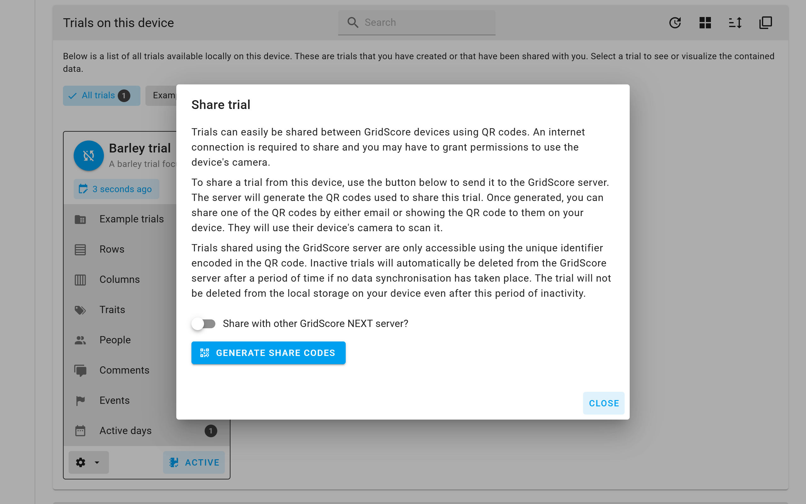
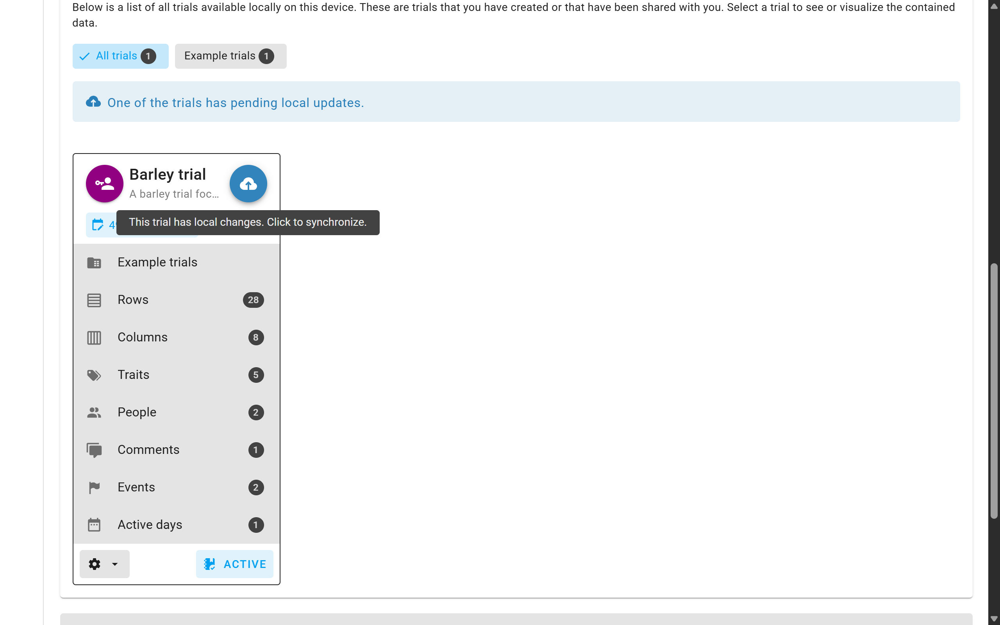
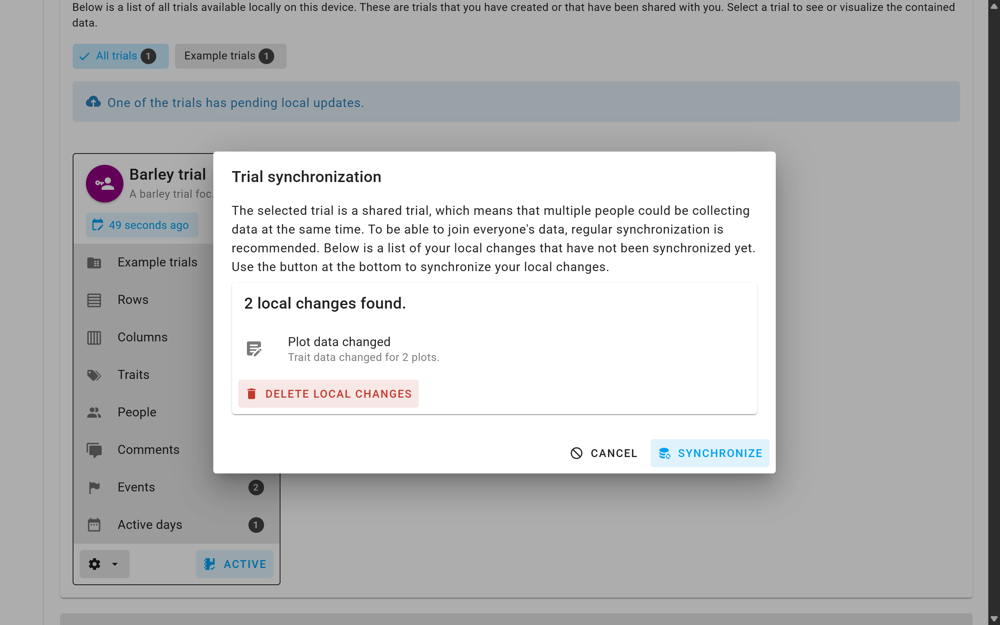
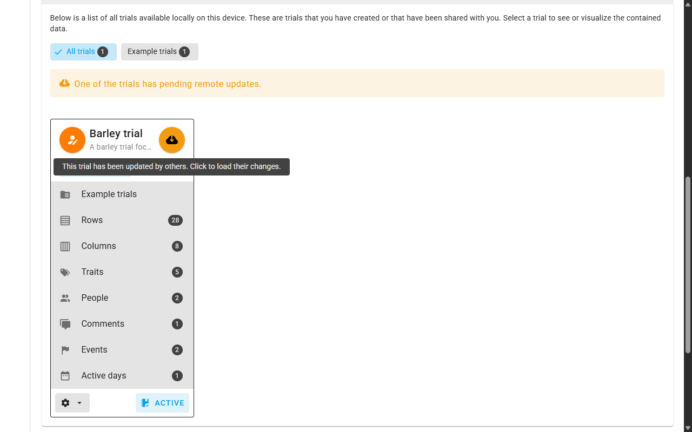
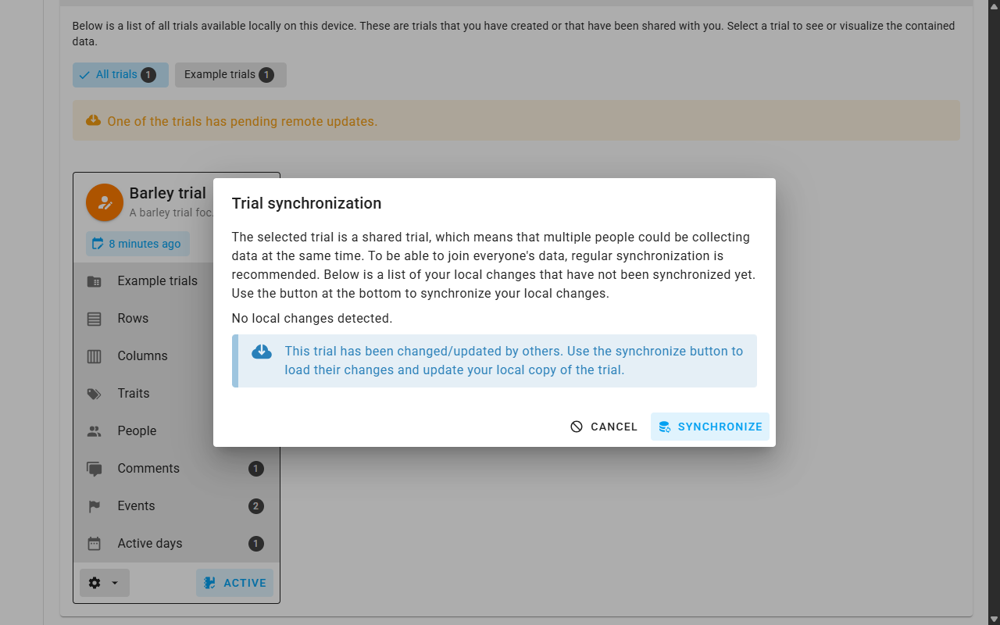
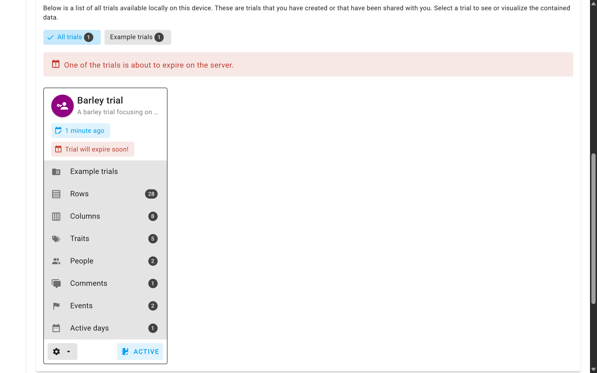
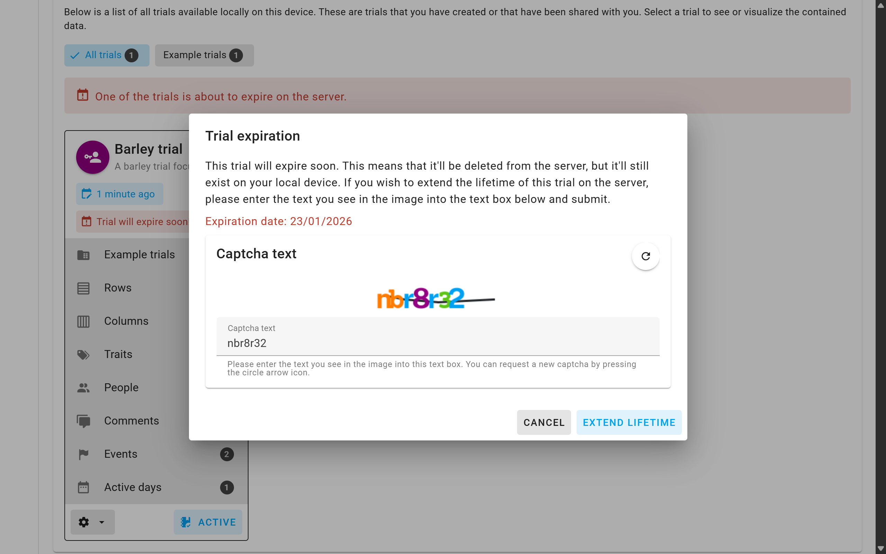
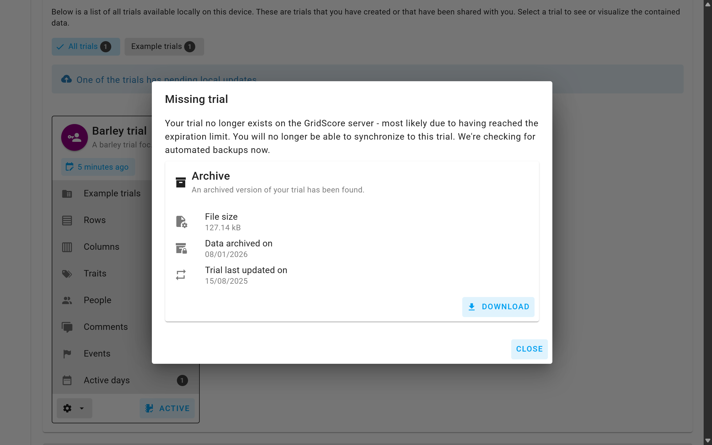

# Data/Trial sharing

While a trial will always be available on your local device, it's often useful or even necessary to be able to work on the same trial on different devices. It's kind of similar to working on the same document online (Google Docs or Office 365). Sometimes you even just want to set the trial up in the comfort of your office where you can easily copy and paste information from other sources and then transfer the trial to one or more mobile devices for data collection.

To achieve this, we use our GridScore server to facilitate data synchronization and use QR codes for sharing a trial. Please note, that these QR codes will grant access to your data same a set of username and password would, so be sure to only share them with people you want to have access to your data.

## Sharing a trial

A trial can be shared from the `Home` screen of GridScore. Identify your trial in the list of local trials (or by using the search bar), then use the cog menu to select the `Share` option.

The window that opens will explain the whole process again. If you are happy with what you read here, click the `Generate share codes` button.

This will share your trial with the GridScore server which will generate three different QR codes. Depending on which one you share with other people or scan with another device, they will have the following permissions:

- **Owner code**: Owners have the exact same permissions as the person who created the trial. They can edit the trial, add traits and record data. How to edit a trial is explained on a <a href="trial-modification.html">separate page</a>.
- **Editor code**: Editors have almost the same permissions as owners, but they cannot modify the trial. Usually, this would be the code you'd share with people who record the data in the field.
- **Viewer code**: Viewers are only able to view the data. They cannot make any modifications at all. However, they can see everything that's going on and also export the data.

Depending on which permissions you want the other person to have you can pick the corresponding QR code. Keep in mind that once shared, you cannot change the permissions of the other person.

---

Generally, once a trial has been shared, everyone who has access to the trial is able to share it with others again. However, they can only share the trial at the same permission level or below, e.g. an editor can only give others access to the trial as editors or viewers. Viewers can only give others access as viewers.

## Synchronizing local changes

Everyone with access to the trial and permissions to record data can now go and collect trials data and add comments. GridScore will keep a transaction log of all changes that are made. On the `Home` screen, trials with local changes will have a turquoise earmark in the top right corner with a cloud upload icon. Clicking on this icon will open a modal window showing all local changes.

The changes are split into categories to give you an overview over the things that can be synchronized:

- **Plot comments added**: How many comments have been added to plots throughout the trial?
- **Plot comments deleted**: How many comments have been deleted from plots throughout the trial?
- **Plots marked**: The number of plots that have been marked/unmarked?
- **Plot trait data changed**: How many trait data points have been changed? This basically represents how much data has been recorded/changed?
- **Traits added**: How many new traits have been added?
- **Traits modified**: How many traits have been modified?
- **Trial modified**:  Has the trial itself been modified?
- **Trial comments added**: How many comments have been added to the overall trial?
- **Trial comments deleted**: How many comments have been deleted from the overall trial?
- **Trial germplasm added**: How many germplasm have been added to the (single column/list) trial?
- **BrAPI IDs changed**: How many BrAPI database IDs for germplasm and traits have been changed?
- **BrAPI configuration changed**: Has the BrAPI configuration changed?

In the example above, one new trait has been added, one plot was marked, data for 13 plots has been changed and one trial comment has been added.

To synchronize these changes, use the `Synchronize` button. This will send the transaction log to the server, incorporate the changes into the trial stored there and combine them with changes from other people and send back the combined and updated trial.

## Loading remote changes

If you haven't modified the trial locally, but someone else has recorded new data or changed properties, a yellow earmark will appear with a cloud download icon. Clicking on it will again open the synchronization modal, but this time, it'll inform you that there are remote changes that you can load to update your local trial. This is always recommended before you go out and record new data.

Click on the `Synchronize` button to load the remote changes, which will update your local copy.

## Trial expiration

The GridScore server will store your data for a period of time. After a while, when no modifications have been made to the trial, the GridScore server can decide to archive your trial. Before this happens, a red banner will be shown on the trial informing you of this and give you ample time to react. These are the steps that a trial goes through before archiving:

1. The trial is active and worked on with regular data synchronization.
2. The trial is completed/forgotten/whatever and no data changes are synchronized for a period of time.
3. The trial reaches 3/4 of its inactive lifespan and the expiration warning banner is shown.
4. The trial reaches the end of its inactive lifespan and is archived.

There are several things you can do before a trial is archived. If you trial is complete, you can export the data for the trial in any of the export formats specified on the <a href="exporting-data.html">exporting data</a> page.

You can also extend the lifetime of your trial by clicking on the red banner which will open the trial expiration modal window. Here you are again informed about the expiration date. To extend the lifetime of a trial, we ask you to provide what's called a Captcha. This tries to make sure that it's actually a human trying to extend the lifetime and not some automated task. You need to enter the combination of letters and numbers into the text box. If you find it difficult to read the text from the image, use the arrow button to get a different Captcha.

Once the server verifies your input, the inactive lifetime of the trial will be reset.

## Trial archive

If the inactive lifetime of a trial expires without being extended, the trial will be archived. This means, we export all the information of the trial, zip it up and then remove it from the database. Whenever you try to synchronize the trial after this date or export to Germinate templates, you will get a notification telling you there is an archive available for you to download.

You will not be able to synchronize your trial after this date as it'll have been an extremely long time since the last time it has been active.