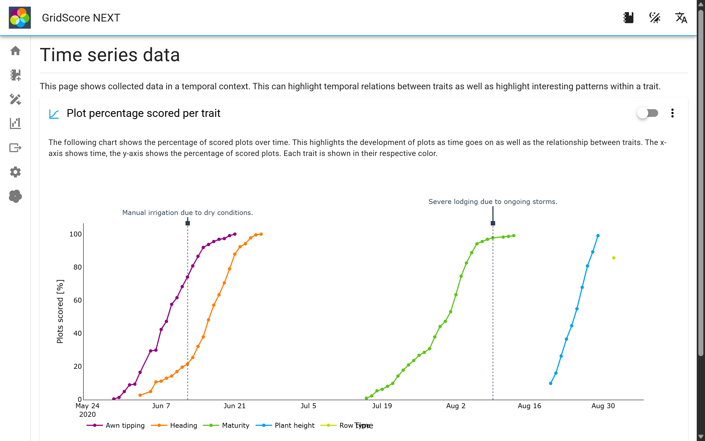
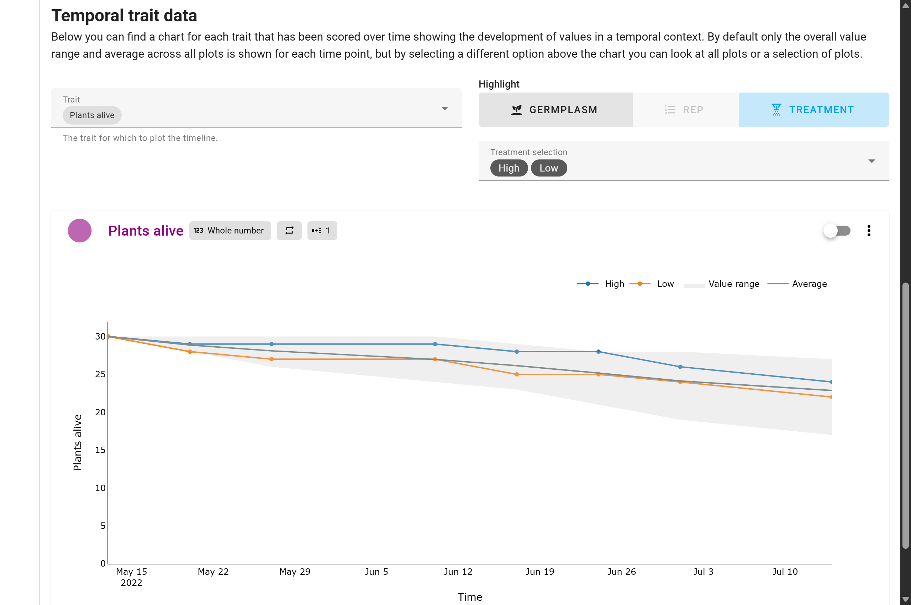
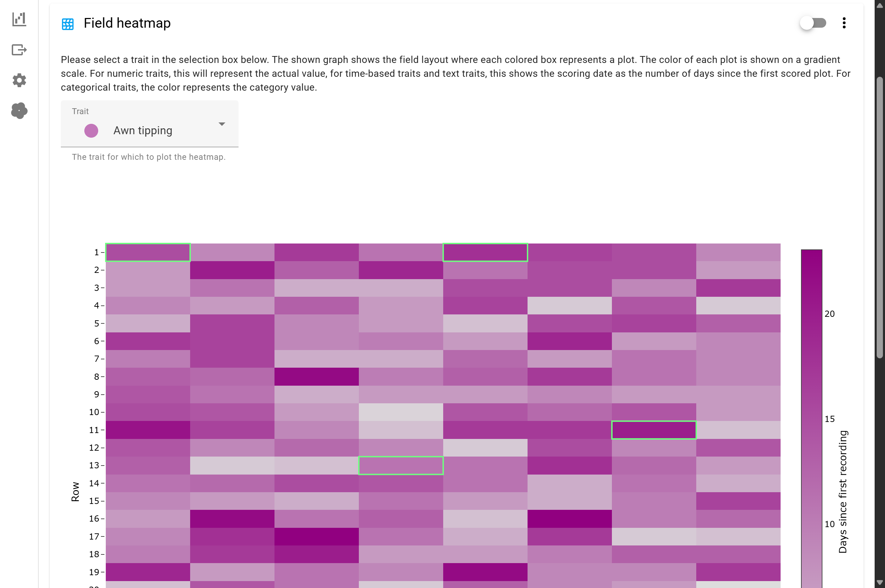
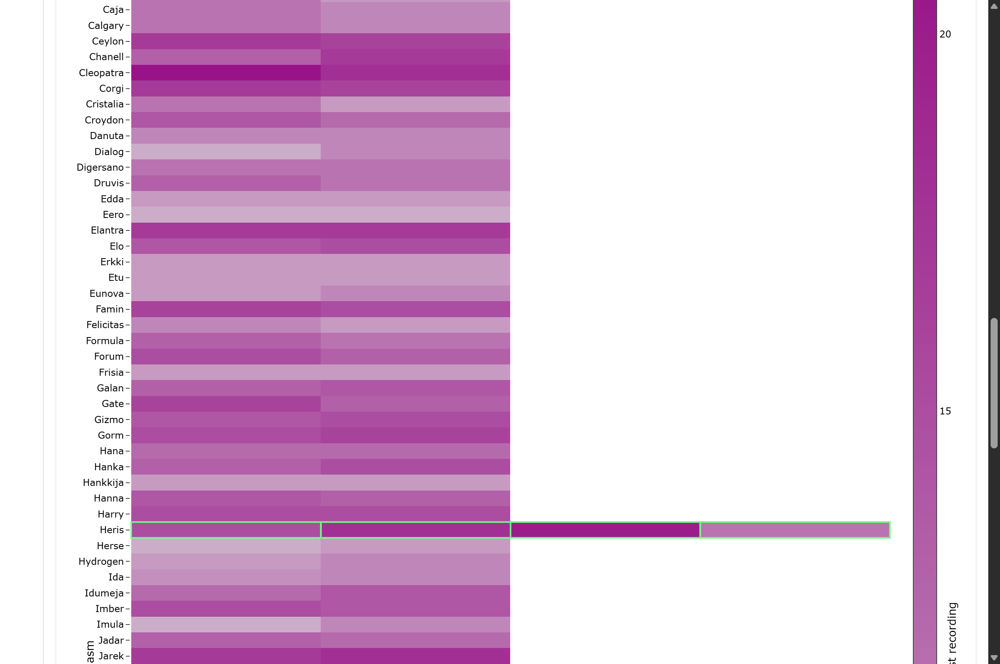
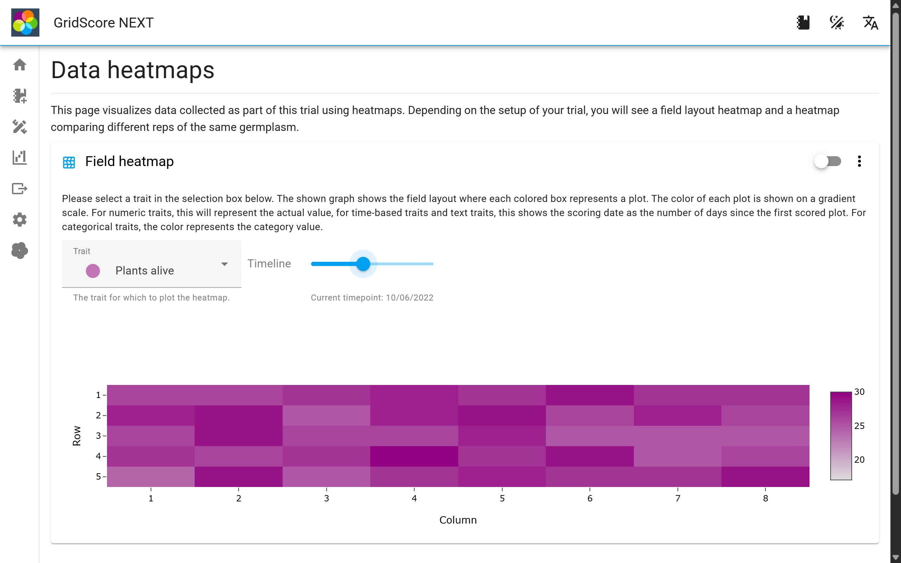
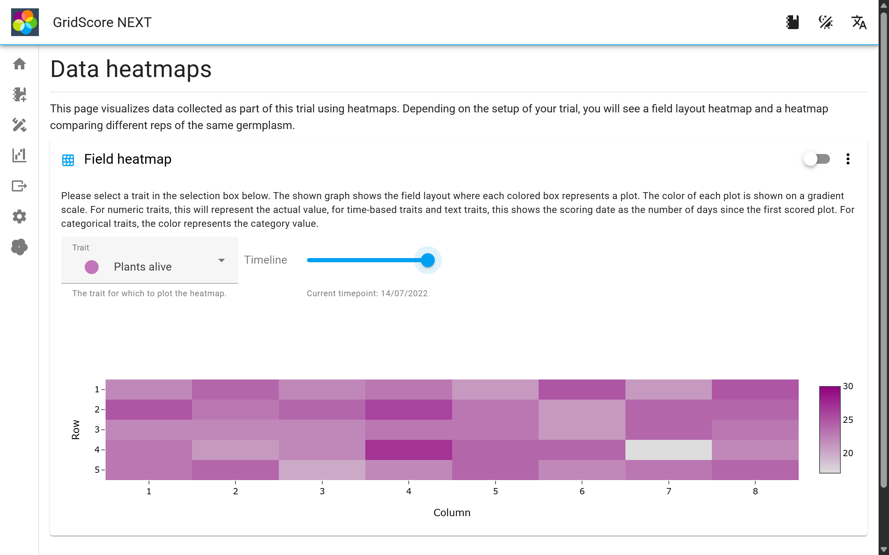
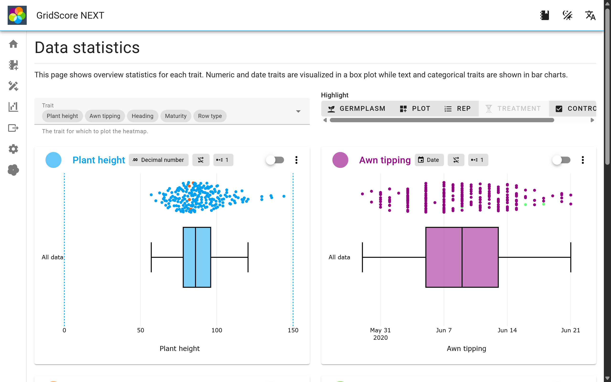

<a href="index.html" class="btn btn-dark">Home</a>

# Visualizing data

GridScore offers a variety of specifically designed data visualizations right in the app. You don't have to export your data first before you can visualize it and they work completely offline, so you can even look at them while you're still out in the field.

## Timeline visualizations

It's often useful to look at your data over time to look for changes or patterns that wouldn't be obvious if you were just looking at a single point in time. For this purpose we have added a couple of timeline visualizations which we will highlight now.

The plot percentage per trait chart shows you by what date how much of your data had already been collected for each trait. Looking at the screenshot above, you can see that data collection started in late May, early June where `Awn tipping` was first scored. Over a period of three weeks, all plots have been scored for this trait. Overlapping that, the scoring of `Heading` has started which follows an almost identical shape and finishes around the end of June. `Maturity` again exhibits a similar shape, but takes place a good six weeks later than `Heading`. Finally, `Plant height` has been scored over a period of a little more than a week and `Row type` was scored on a single day, but not for all plots. It only reaches a completeness percentage of 85%.

Similarly to the overall trial timeline, we can also look at the timeline of a single trait, assuming it's a trait that allows multiple measurements over time. In this case, we're looking at the number of plants that are still alive. When the trial started, there were 30 plants per plot, which is why all lines start at 30. Someone then went back and counted the plants that were still alive every every few weeks and you can see the numbers dropping over time. For some plots they drop faster and for some slower. You can use the `Selection` mode to only show a sub-selection of all plots.

## Heatmap visualizations

Heatmaps are very powerful visualizations that excel at highlighting potential patterns in your data. GridScore offers a selection of different heatmaps both for a view onto the whole trial as well as over time.

The two main types of heatmaps are a field-based heatmap that shows your data in the same shape and layout as your field plan. The other one is a replicate-based heatmap which is shown if you specified rep numbers in your trial.

The field heatmap shows the distribution of values across your whole trial for a selected trait. We use a gradient for numeric and date traits that ranges from white to the color representing the trait. The darker the color, the higher the value for that trait. Time based traits are converted into "days since first recording", simply because it puts the date values into perspective.

Similarly to the field heatmap, the rep heatmap uses the same color representation of values, but the arrangement of the heatmap is now based on the germplasm and the rep where germplasm runs along the side/y-axis and the reps along the bottom/x-axis. This plot is a good way of looking at the spread of data values across all reps of a germplasm. It can highlight potential errors in your data if, for example, the values were significantly

For traits that allow recording data across time, GridScore will show a time scale/slider that you can use to move through time. The heatmap will adjust and show the data for the selected date. The screenshot above shows an early time point while the one below shows a later time point.

## Statistical visualizations

The last type of visualization that's available are statistical plots like box plots and bar charts. These show the distribution of values for the selected traits and highlight potential outliers in your data. Sometimes these outliers are errors, but other times they may represent the most interesting data points in your trial. The example shows the distribution of values for the `Plant height` trait. There are 5 data points that are higher than the rest of the dataset and they represent the tallest plots in the whole trial. Depending on your trial you may be looking for those extremes and GridScore can easily highlight them for you.

<a href="index.html" class="btn btn-dark">Home</a>